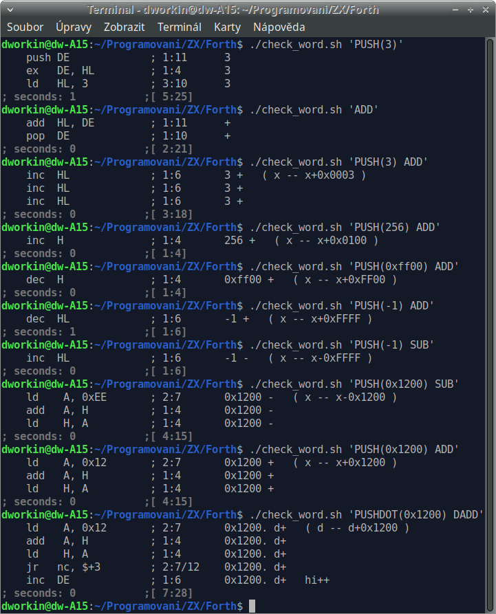
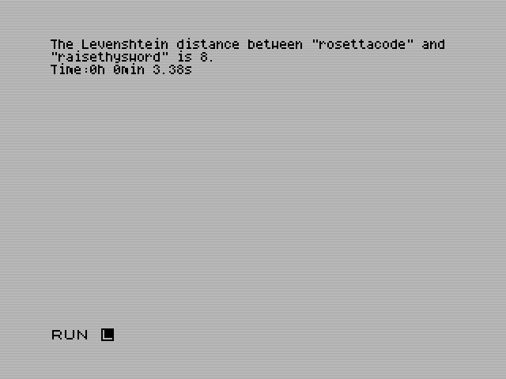

# M4 FORTH: A Forth compiler for the Z80 CPU and ZX Spectrum

A simple FORTH compiler created using M4 macros. Creates human readable and annotated code in the Z80 assembler. No peephole optimization is used, but a new word with optimized code is created for some frequently related words. For example, for the `dup number condition if`.
The small Runtime library for listing numbers and text is intended for the ZX Spectrum computer.

Despite its primitivity, M4 FORTH produces a shorter code and 2-4 times faster code than zd88k, probably the best compiler for the Z80.

https://github.com/DW0RKiN/M4_FORTH/tree/master/Benchmark

Due to its simplicity, the compiler is suitable for study purposes. Can be easily edited. For the most part, it is merely a substitution of the FORTH word for a sequence of instructions.

The more complex parts are branches and loops.

## Use registers

Internal implementation of data stack and return address stack.

    Data Stack:

    HL                  TOP (top of stack)
    DE                  NOS (next on stack)
    (SP)                NNOS
    (SP+2)
    (SP+4)
    ...

    Return Address Stack or Loop stack:

    (HL')
    (HL'+2)
    (HL'+4)
    (HL'+6)
    (HL'+8)
    ...

    Free registers: AF, AF', BC, DE', BC', IX, IY

    Pollutes register: AF, AF', BC, DE', BC'

## Branching

Branching internally creates new names for the label. This is a simple increase in numbers for `else100` and `endif100`. Numbers start with three digits for better alignment. At the end of the branch, it is determined whether the `else` part has been used. `if` always jumps on `else1..`. If `else1..` was not used it should stack the value with `endif1..`. `endif1..` always exists for potential use to jump out of a branch.`

## Loops

Looping internally creates new names for the label. `DO` increments the last number used at `do100`. And store it on the stack. `LOOP` reads the last stored number from the stack. This connects DO and LOOP whether they are used in parallel or in series. When the program is executed, the loops store the indexes on the return address stack.

## Creating new words

It is converted to the creation of new functions. The return value of the function is stored in the return address stack. Recursion is triggered by simply calling yourself.

## Compilation

    m4 my_program_name.m4 > my_program_name.asm
    pasmo my_program_name.asm my_program_name.bin

Or use a bash script:

    ./compile.sh my_program_name

## Hello World!

For clarity, macros are divided into several files and stored in the M4 directory.
To avoid having to manually include each file, a `FIRST.M4` file is created that includes all other files.
So the first thing that needs to be done is to include this file using:

    include(`./M4/FIRST.M4')dnl

On the first line immediately change quotes to `{` and `}`. All M4 macros use these new quotes.

All used library functions are automatically added at the end of the file. For example, listing a number, multiplying or dividing. Others add variables and strings. If you need to place something else behind them, you have to manually write:

    include({./M4/LAST.M4})dnl

And everything he writes underneath will be the last.

In order to be able to call a program from Basic and return it again without error, the `INIT()` and `STOP` macros must be used.
`INIT(xxx)` stores shadow registers and sets the initial value of the return address stack.

In order for the compiler not to compile the program from the zero address, it must still contain the ORG value. For example, ORG 0x8000.

File Hello.m4

    include(`./M4/FIRST.M4')dnl
    ORG 0x8000
    INIT(60000)
    PRINT({"Hello World!"})
    STOP

m4 Hello.m4

    ORG 0x8000

    ;   ===  b e g i n  ===
        ld  (Stop+1), SP    ; 4:20      init   storing the original SP value when the "bye" word is used
        ld    L, 0x1A       ; 2:7       init   Upper screen
        call 0x1605         ; 3:17      init   Open channel
        ld   HL, 60000      ; 3:10      init   Init Return address stack
        exx                 ; 1:4       init

        push DE             ; 1:11      print     "Hello World!"
        ld   BC, size101    ; 3:10      print     Length of string101
        ld   DE, string101  ; 3:10      print     Address of string101
        call 0x203C         ; 3:17      print     Print our string with ZX 48K ROM
        pop  DE             ; 1:10      print

    Stop:                   ;           stop
        ld   SP, 0x0000     ; 3:10      stop   restoring the original SP value when the "bye" word is used
        ld   HL, 0x2758     ; 3:10      stop
        exx                 ; 1:4       stop
        ret                 ; 1:10      stop
    ;   =====  e n d  =====

    STRING_SECTION:
    string101:
        db "Hello World!"
      size101 EQU $ - string101

[FIRST.M4](./M4/FIRST.M4) will try to find the path to its directory and attach other files. It can detect if it lies in the same directory as the source file. If it lies in the subdirectory ./M4, or if it lies in the neighboring directory ../M4.
If you have the source file elsewhere it will help to define the path manually using the M4PATH macro.

    define(M4PATH,`/home/dw0rkin/Programovani/Forth/M4/')dnl
    include(M4PATH`FIRST.M4')dnl
    ORG 0x8000
    INIT(60000)
    PRINT("Hello World!")
    STOP

## Limitations of the M4 markup language

Macro names cannot be just `.` or `>`, but an alphanumeric name. So must be renamed to `DOT` or `LT`. `2dup` to `_2DUP`. `3` to `PUSH(3)`.
All FORTH words must be capitalized! Because `+` is written as `ADD`. And `add` is reserved for assembler instructions.

Theoretically, your function name or variable may conflict with the name of the macro used. So check it out. `ifdef({your_name},{used},{not used})` The worse case is when you make a mistake in the name of the macro. Then it will not expand and will probably be hidden in the comment of the previous macro.

https://github.com/DW0RKiN/M4_FORTH/blob/master/fth2m4.sh

https://github.com/DW0RKiN/M4_FORTH/blob/master/fth2m4.awk

This script, written in bash with awk, is a compiler that translates source code from Forth to M4 FORTH. 
However, further manual editing may be required on the output generated by this script.

In this compiler, any word ending with `"` is considered the start of a character string. 
The compiler will then not interpret any further characters and will simply add them to the character string until it encounters the closing `"` character.
Similarly, words ending with `(` will be treated as the beginning of a character string. The only difference is that this time the closing character will be `)`, and the compiler will search for the first occurrence of it.

M4 Forth supports two number formats: one for a 16-bit size, where numbers are stored on a data stack, and another format for a 5-byte floating point number, which is stored on a separate stack and used by the ZX Spectrum ROM. To accommodate this, I have added an optional parameter `-zfloat` to the script. 
Enabling this parameter activates the conversion to the alternative number format.

Some words that are not recognized by M4 FORTH will be attempted to be interpreted as functions based on known words. Words that do not conform to the M4 FORTH standard (such as CASE) will be attempted to be transformed from standard Forth to the M4 FORTH variant.

For the remaining unknown words, an error will be displayed, and they will be ignored.

## Implemented words FORTH

### Stack manipulation

https://github.com/DW0RKiN/M4_FORTH/blob/master/M4/stack.m4

|         Original         |    M4 FORTH         | Optimization     |  Data stack                      |
| :---------------------------: | :----------------------: | :-------------------: | :------------------------------------ |
|           swap           |         SWAP        |                  |      ( x2 x1 -- x1 x2 )          |
|         swap over        |       SWAP OVER     |    SWAP_OVER     |      ( x2 x1 -- x1 x2 x1 )       |
|         swap over        |       SWAP OVER     |      TUCK        |      ( x2 x1 -- x1 x2 x1 )       |
|         swap `7`         |    SWAP PUSH(`7`)   |  SWAP_PUSH(`7`)  |      ( x2 x1 -- x1 x2 `7` )      |
|         `6` swap         |    PUSH(`6`) SWAP   |  PUSH_SWAP(`6`)  |         ( x1 -- `6` x1 )         |
|       dup `5` swap       |  DUP PUSH(`5`) SWAP |  PUSH_OVER(`5`)  |         ( x1 -- x1 `5` x1 )      |
|          2swap           |        _2SWAP       |                  | (x1 x2 x3 x4 -- x3 x4 x1 x2)     |
|            dup           |          DUP        |                  |         ( x1 -- x1 x1 )          |
|          dup dup         |        DUP DUP      |     DUP_DUP      |         ( x1 -- x1 x1 x1 )       |
|           ?dup           |     QUESTIONDUP     |                  |         ( x1 -- 0 \| x1 x1 )     |
|           2dup           |        _2DUP        |                  |      ( x2 x1 -- x2 x1 x2 x1 )    |
|           3dup           |        _3DUP        |                  |      ( c b a -- c b a c b a )    |
|`2` pick `2` pick `2` pick|         ....        |      _3DUP       |      ( c b a -- c b a c b a )    |
|           4dup           |        _4DUP        |                  |      ( d2 d1 -- d2 d1 d2 d1 )    |
|        2over 2over       |    _2OVER _2OVER    |      _4DUP       |      ( d2 d1 -- d2 d1 d2 d1 )    |
|           drop           |         DROP        |                  |         ( x1 -- )                |
|          2drop           |        _2DROP       |                  |      ( x2 x1 -- )                |
|           nip            |          NIP        |                  |      ( x2 x1 -- x1 )             |
|           2nip           |         2NIP        |                  |    ( d c b a -- b a )            |
|           tuck           |         TUCK        |                  |      ( x2 x1 -- x1 x2 x1 )       |
|          2tuck           |       _2TUCK        |                  |    ( d c b a -- b a d c b a )    |
|           over           |         OVER        |                  |      ( x2 x1 -- x2 x1 x2 )       |
|         over swap        |       OVER SWAP     |     OVER_SWAP    |      ( x2 x1 -- x2 x2 x1 )       |
|          2over           |       _2OVER        |                  |    ( d c b a -- d c b a d c )    |
|        2over nip         |     _2OVER NIP      |    _2OVER_NIP    |      ( c b a -- c b a c )        |
|           rot            |         ROT         |                  |   ( x3 x2 x1 -- x2 x1 x3 )       |
|         rot drop         |       ROT DROP      |     ROT_DROP     |   ( x3 x2 x1 -- x2 x1 )          |
|          2rot            |        _2ROT        |                  |( f e d c b a -- d c b a f e )    |
|          -rot            |         NROT        |                  |   ( x3 x2 x1 -- x1 x3 x2 )       |
|         -2rot            |        N2ROT        |                  |( f e d c b a -- b a f e d c )    |
|        -rot swap         |       NROT SWAP     |     NROT_SWAP    |   ( x3 x2 x1 -- x1 x2 x3 )       |
|        -rot nip          |       NROT NIP      |     NROT_NIP     |   ( x3 x2 x1 -- x1 x2 )          |
|        -rot 2swap        |     NROT _2SWAP     |    NROT_2SWAP    |( x4 x3 x2 x1 -- x3 x2 x4 x1 )    |
|   -rot swap 2swap swap   |NROT SWAP _2SWAP SWAP|    STACK_BCAD    |    ( d c b a -- b c a d )        |
|      over 2over drop     |  OVER _2OVER DROP   |    STACK_CBABC   |      ( c b a -- c b a b c )      |
|      over `3` pick       | OVER PUSH(`3`) PICK |    STACK_CBABC   |      ( c b a -- c b a b c )      |
|  `2` pick `2` pick swap  |         ....        |    STACK_CBABC   |      ( c b a -- c b a b c )      |
| 2over nip 2over nip swap |         ....        |    STACK_CBABC   |      ( c b a -- c b a b c )      |
|          `123`           |      PUSH(`123`)    |                  |            ( -- `123` )          |
|          `2` `1`         | PUSH(`2`) PUSH(`1`) |  PUSH2(`2`,`1`)  |            ( -- `2` `1` )        |
|        addr `7` @        |     PUSH((addr))    |                  |    *addr = 7 --> ( -- `7`)       |
|         `6` OVER         |    PUSH(`6`) OVER   |  PUSH_OVER(`6`)  |          ( a -- a `6` a )        |
|         OVER `5`         |    OVER PUSH(`5`)   |  OVER_PUSH(`5`)  |        ( b a -- b a b `5` )      |
|                          |                     |  PUSH2((A),`2`)  |    *A = 4 --> ( -- `4` `2` )     |
|        drop `5`          |                     |  DROP_PUSH(`5`)  |         ( x1 -- `5`)             |
|         dup `4`          |                     |   DUP_PUSH(`4`)  |         ( x1 -- x1 x1 `4`)       |
|       `287454020.`       | PUSHDOT(`287454020`)|                  |            ( -- `0x1122` `0x3344`|
|           pick           |         PICK        |                  |          ( u -- xu )             |
|         `2` pick         |                     |  PUSH_PICK(`2`)  |   ( x2 x1 x0 -- x2 x1 x0 x2 )    |
|          depth           |        DEPTH        |                  |            ( -- x )              |

|        Original          |    M4 FORTH         |  Data stack                  | Return address stack |
| :---------------------------: | :----------------------: | :-------------------------------- | :------------------------ |
|            >r            |         TO_R        |         ( x1 -- )            |        ( -- x1 )     |
|          dup >r          |       DUP_TO_R      |         ( x1 -- x1 )         |        ( -- x1 )     |
|            r>            |        R_FROM       |            ( -- x1 )         |     ( x1 -- )        |
|            r@            |        R_FETCH      |            ( -- x1 )         |     ( x1 -- x1 )     |
|          rdrop           |         RDROP       |            ( -- )            |     ( x1 -- )        |
|     r> r> swap >r >r     |         RSWAP       |            ( -- )            |    ( b a -- a b )    |
|           2>r            |       _2TO_R        |        ( b a -- )            |        ( -- b a )    |
|           2r>            |      _2R_FROM       |            ( -- b a )        |    ( b a -- )        |
|           2r@            |      _2R_FETCH      |            ( -- b a )        |    ( b a -- b a )    |
|         2rdrop           |       _2RDROP       |            ( -- )            |    ( b a -- )        |
|  2r> 2r> 2swap 2>r 2>r   |       _2RSWAP       |            ( -- )            |( d c b a -- b a d c )|

### Arithmetic

Look out! A symmetric variant is implemented for the division and remainder functions after division. So the resulting value is rounded up to zero. But FORTH uses floored divisions, which it always rounds down. For negative numbers, then:

    FORTH-83 standard
    7 -3 /mod --> -2 -3
    -7 3 /mod -->  2 -3
    M4 FORTH
    7 -3 /mod -->  1 -2
    -7 3 /mod --> -1 -2

https://github.com/DW0RKiN/M4_FORTH/blob/master/M4/arithmetic.m4

Support for fast multiplication or division by a constant is here:

https://github.com/DW0RKiN/M4_FORTH/blob/master/M4/divmul

    x  ...   signed 16-bit number
    s  ...   signed 16-bit number
    u  ... unsigned 16-bit number
    d  ...   signed 32-bit number = hi lo
    ud ... unsigned 32-bit number = hi lo
    hi ... high(d)= 16-bit number
    lo ...  low(d)= 16-bit number
    f  ... floating 16-bit number (Danagy format)
    z  ... floating 40-bit number (ZX Spectrum format)
    p  ... pointer
    pu ... pointer to unsigned number
    pd ... pointer to 32-bit number
    R: ... return address stack
    Z: ... ZX Spectrum floating-point calculator stack

| Original   |   M4 FORTH   |  Optimization   |  Data stack               |
| :-------------: | :---------------: | :------------------: | :----------------------------- |
|     +      |      ADD     |                 |   ( x2 x1 -- x )          |
|   `3` +    |              |  PUSH_ADD(`3`)  |       ( x -- x+`3` )      |
|   dup +    |              |     DUP_ADD     |       ( x -- x+x )        |
|   dup +    |              |      _2MUL      |       ( x -- 2*x )        |
|  dup `3` + |              |DUP_PUSH_ADD(`3`)|       ( x -- x x+`3` )    |
|   over +   |              |     OVER_ADD    |   ( x2 x1 -- x2 x1+x2  )  |
|     -      |      SUB     |                 |   ( x2 x1 -- x )          |
|   `3` -    |              |  PUSH_SUB(`3`)  |       ( x -- x-`3` )      |
|   over -   |              |     OVER_SUB    |   ( x2 x1 -- x2 x1-x2  )  |
|    max     |      MAX     |                 |   ( x2 x1 -- max )        |
|  `3` max   | PUSH_MAX(`3`)|                 |      ( x1 -- max )        |
|    min     |      MIN     |                 |   ( x2 x1 -- min )        |
|  `3` min   | PUSH_MIN(`3`)|                 |      ( x1 -- min )        |
|   negate   |     NEGATE   |                 |      ( x1 -- -x1 )        |
|    abs     |      ABS     |                 |       ( n -- u )          |
|     *      |      MUL     |                 |   ( x2 x1 -- x )          |
|     */     |    MULDIV    |                 |   ( x2 x1 -- x )          |
|   */mod    |  MULDIVMOD   |                 |   ( x2 x1 -- x_mod x_div )|
|     /      |      DIV     |                 |   ( x2 x1 -- x )          |
|    mod     |      MOD     |                 |   ( x2 x1 -- x )          |
|    /mod    |    DIVMOD    |                 |   ( x2 x1 -- x )          |
|     u*     |      MUL     |                 |   ( x2 x1 -- x )          |
|  `+12` *   |              |  PUSH_MUL(`12`) |   ( x2 x1 -- x )          |
|     u/     |     UDIV     |                 |   ( x2 x1 -- x )          |
|    umod    |     UMOD     |                 |   ( x2 x1 -- x )          |
|    u/mod   |    UDIVMOD   |                 |   ( x2 x1 -- rem quot )   |
|     1+     |    _1ADD     |                 |       ( x -- x++ )       |
|     1-     |    _1SUB     |                 |       ( x -- x-- )       |
|     2+     |    _2ADD     |                 |       ( x -- x+2 )       |
|     2-     |    _2SUB     |                 |       ( x -- x-2 )       |
|     2*     |    _2MUL     |                 |       ( x -- x*2 )       |
|     2/     |    _2DIV     |                 |       ( x -- x/2 )       |
|    256*    |   _256MUL    |                 |       ( x -- x*256 )     |
|    256/    |   _256DIV    |                 |       ( x -- x/256 )     |
|    s>d     |    S_TO_D    |                 |       ( x -- 0 x )       |
|     m+     |     MADD     |                 |   ( d2 x1 -- d2+x1 )      |
|     m*     |     MMUL     |                 |   ( x2 x1 -- d32 )        |
|     um*    |     UMMUL    |                 |   ( u2 u1 -- ud )         |
|   fm/mod   |   FMDIVMOD   |                 | ( hi lo u -- rem quot )   |
|   sm/rem   |   SMDIVREM   |                 | ( hi lo u -- rem quot )   |
|   um/mod   |   UMDIVMOD   |                 | ( hi lo u -- rem quot )   |

#### 8bit

| Original   |   M4 FORTH   |  Optimization   |  Data stack               |  Comment                 |
| :-------------: | :---------------: | :------------------: | :----------------------------- | :---------------------------- |
|            |     CADD     |                 |   ( x2 x1 -- x3 )         | x3=256*hi(x1)+lo(x2+x1)  |
|            |     CSUB     |                 |   ( x2 x1 -- x3 )         | x3=256*hi(x1)+lo(x2-x1)  |
|            |     HADD     |                 |   ( x2 x1 -- x3 )         | x3=256*(hi(x1)+hi(x2))+lo(x1) |
|            |     HSUB     |                 |   ( x2 x1 -- x3 )         | x3=256*(hi(x2)-hi(x1))+lo(x1) |
|            |    _1CADD    |                 |      ( x1 -- x2 )         | x2=256*hi(x1)+lo(x1+1)   |
|            |    _1CSUB    |                 |      ( x1 -- x2 )         | x2=256*hi(x1)+lo(x1-1)   |
|            |    _1HADD    |                 |      ( x1 -- x1+`256` )   |
|            |    _1HSUB    |                 |      ( x1 -- x1-`256` )   |

#### 32bit

( d32 -- hi16 lo16 )

| Original   |   M4 FORTH   |  Optimization   |  Data stack               |
| :-------------: | :---------------: | :------------------: | :----------------------------- |
|     D+     |     DADD     |                 |   ( d2 d1 -- d )          |
|  `3.` D+   |              |PUSHDOT_DADD(`3`)|       ( d -- d+`3` )      |
|  2dup D+   |              |   _2DUP_DADD    |       ( d -- d+d )        |
|  2over D+  |              |   _2OVER_DADD   |   ( d2 d1 -- d2 d1+d2  )  |
|     D-     |     DSUB     |                 |   ( d2 d1 -- d )          |
|   `3.` D-  |              |PUSHDOT_DSUB(`3`)|       ( d -- d-`3` )      |
|  2swap D-  |              |   _2SWAP_DSUB   |       ( d -- d+d )        |
|  2over D-  |              |   _2OVER_DSUB   |   ( d2 d1 -- d2 d1-d2  )  |
|    Dabs    |     DABS     |                 |       ( d -- ud )         |
|    Dmax    |     DMAX     |                 |   ( d2 d1 -- dmax )       |
| `3.` Dmax  |              |PUSHDOT_DMAX(`3`)|       ( d -- dmax )       |
|    Dmin    |     DMIN     |                 |   ( d2 d1 -- dmin )       |
| `3.` Dmin  |              |PUSHDOT_DMIN(`3`)|       ( d -- dmin )       |
|   Dnegate  |    DNEGATE   |                 |       ( d -- -d )         |
|    D1+     |    D1ADD     |                 |       ( d -- d++ )        |
|    D1-     |    D1SUB     |                 |       ( d -- d-- )        |
|    D2+     |    D2ADD     |                 |       ( d -- d+2 )        |
|    D2-     |    D2SUB     |                 |       ( d -- d-2 )        |
|    D2*     |    D2MUL     |                 |       ( d -- d*2 )        |
|    D2/     |    D2DIV     |                 |       ( d -- d/2 )        |
|   D256*    |   D256MUL    |                 |       ( d -- d*256 )      |
|   D256/    |   D256DIV    |                 |       ( d -- d/256 )      |
|    d>s     |    D_TO_S    |                 |    ( 0 x1 -- x1 )         |

#### Pointer to 32bit number

Numbers must not be at addresses that divide a 256-byte segment. Use NO_SEGMENT() or ALIGN().

| Original                     |   M4 FORTH   |  Data stack               |  Comment                   |
| :-------------------------------: | :---------------: | :----------------------------- | :------------------------------ |
|2dup 2@ rot 2@ d+ 2over nip 2!|    PDADD     |   ( p2 p1 -- p2 p1 )      | [p1] =[p2] + [p1]
|                              |    PDSUB     |   ( p2 p1 -- p2 p1 )      | [p1] =[p2] - [p1]
|                              | PDSUB_NEGATE |   ( p2 p1 -- p2 p1 )      | [p1] =[p1] - [p2]
|                              |   PDNEGATE   |      ( p1 -- p1 )         | [p1] = -[p1]
|                              |    PD1ADD    |      ( p1 -- p1 )         | [p1] += 1
|                              |    PD1SUB    |      ( p1 -- p1 )         | [p1] -= 1

#### Pointer to 1..256 bytes number

Numbers must not be at addresses that divide a 256-byte segment. Use NO_SEGMENT() or ALIGN().

| Original   |   M4 FORTH   |  Data stack                  |  Comment                   |
| :-------------: | :---------------: | :-------------------------------- | :------------------------------ |
|            |    PADD(b)   |   ( p2 p1 -- p2 p1 )         | [p1] =[p2] + [p1]
|            |    PADC(b)   |   ( p2 p1 -- p2 p1 )         | [p1] =[p2] + [p1] + carry
|            |    PSUB(b)   |   ( p2 p1 -- p2 p1 )         | [p1] =[p2] - [p1]
|            |    PSBC(b)   |   ( p2 p1 -- p2 p1 )         | [p1] =[p2] - [p1] - carry
|            |PSUB_NEGATE(b)|   ( p2 p1 -- p2 p1 )         | [p1] =[p1] - [p2]
|            |  PNEGATE(b)  |      ( p1 -- p1 )            | [p1] = -[p1]
|            |   P1ADD(b)   |      ( p1 -- p1 )            | [p1] += 1
|            |   P1SUB(b)   |      ( p1 -- p1 )            | [p1] -= 1
|            |   PUMUL(b)   |( p3 p2 p1 -- p3 p2 p1 )      | [p1] = [p3] * [p2]
|            | PUDIVMOD(b)  |( pu3 pu2 pu1 -- pu3 pu2 pu1 )| [pu1] = [pu2] / [pu3], [pu2] = [pu2] mod [pu3]
|            |  PDIVMOD(b)  |( p3 p2 p1 -- p3 p2 p1 )      | [p1] = [p2] / [p3], [p2] = [p2] mod [p3]

### Floating-point

https://github.com/DW0RKiN/M4_FORTH/blob/master/M4/float.m4

Danagy format `S EEE EEEE MMMM MMMM`

https://github.com/DW0RKiN/Floating-point-Library-for-Z80

For a logical comparison of two numbers as f1> f2, exactly the same result applies as for a comparison of two integer numbers with a sign.

| Original   |   M4 FORTH   |  Data stack          |  Comment                   |
| :-------------: | :---------------: | :------------------------ | :------------------------------ |
|    s>f     |      S2F     |       ( s1 -- f1 )   |                            |
|    u>f     |      U2F     |       ( u1 -- f1 )   |                            |
|    f>s     |      F2S     |       ( f1 -- s1 )   |                            |
|    f>u     |      F2U     |       ( f1 -- u1 )   |                            |
|     f+     |     FADD     |    ( f2 f1 -- f3 )   | f3 = f2 + f1               |
|     f-     |     FSUB     |    ( f2 f1 -- f3 )   | f3 = f2 - f1               |
|  fnegate   |    FNEGATE   |       ( f1 -- f2 )   | f2 = -f1                   |
|    fabs    |     FABS     |       ( f1 -- f2 )   | f2 = abs(f1)               |
|     f.     |     FDOT     |       ( f1 -- )      |                            |
|     f*     |     FMUL     |    ( f2 f1 -- f3 )   | f3 = f2 * f1               |
|     f/     |     FDIV     |    ( f2 f1 -- f3 )   | f3 = f2 / f1               |
|   fsqrt    |    FSQRT     |       ( f1 -- f2 )   |                            |
|   ftrunc   |    FTRUNC    |       ( f1 -- f2 )   | f2 = int(f1), round to zero|
|            |    FFRAC     |       ( f1 -- f2 )   | f2 = f1 % 1.0              |
|    fexp    |     FEXP     |       ( f1 -- f2 )   | f2 = e^(f1)                |
|     fln    |      FLN     |       ( f1 -- f2 )   | f2 = ln(f1)                |
|    fmod    |     FMOD     |    ( f2 f1 -- f3 )   | f3 = f2 % f1               |
|     f2*    |     F2MUL    |       ( f1 -- f2 )   | f2 = f1 * 2.0              |
|     f2/    |     F2DIV    |       ( f1 -- f2 )   | f2 = f1 / 2.0              |
|    fsin    |     FSIN     |       ( f1 -- f2 )   | f2 = sin(f1), f1 <= ±π/2   |

#### ZX48 ROM Floating-point

    ZX Spectrum floating-point format:
        EEEE EEEE SMMM MMMM MMMM MMMM MMMM MMMM MMMM MMMM
             exp,  sign + m,        m,        m,        m

    ZX Spectrum integer format:
        0000 0000 SSSS SSSS LLLL LLLL HHHH HHHH 0000 0000
                0, 8x dup S,       lo,       hi,        0

https://github.com/DW0RKiN/M4_FORTH/blob/master/M4/zx48float.m4
https://github.com/DW0RKiN/M4_FORTH/blob/master/M4/zx48float_end.m4

|   Original   |    M4 FORTH     |  Data stack               |  Comment                    |
| :---------------: | :------------------: | :----------------------------- | :------------------------------- |
|     d>f      |      D_TO_Z     |( d -- ) ( Z: -- d )       | -2147483648..2147483647     |
|     s>f      |      S_TO_Z     |( x -- ) ( Z: -- x )       | -32768..32767               |
|   `4` s>f    | PUSH_S_TO_Z(`4`)|  ( -- ) ( Z: -- `4` )     | -65535..65535               |
|     f>d      |      Z_TO_D     |  ( -- d ) ( Z: z -- )     |                             |
|     f>s      |      Z_TO_S     |  ( -- x ) ( Z: z -- )     |                             |
|     fabs     |      ZABS       |  ( -- ) ( Z: z1 -- z2 )   | z2 = abs(z1)                |
|    facos     |      ZACOS      |  ( -- ) ( Z: z1 -- z2 )   | z2 = arccos(z1)             |
|      f+      |      ZADD       |  ( -- ) ( Z: z1 z2 -- z3 )| z3 = z1 + z2                |
|    fasin     |      ZASIN      |  ( -- ) ( Z: z1 -- z2 )   | z2 = arcsin(z1)             |
|    fatan     |      ZATAN      |  ( -- ) ( Z: z1 -- z2 )   | z2 = arctan(z1)             |
|     fcos     |      ZCOS       |  ( -- ) ( Z: z1 -- z2 )   | z2 = cos(z1)                |
|      f/      |      ZDIV       |  ( -- ) ( Z: z1 z2 -- z3 )| z3 = z1 / z2                |
|      f.      |      ZDOT       |  ( -- ) ( Z: z -- )       | fprintf("%f", z);           |
|    fdrop     |      ZDROP      |  ( -- ) ( Z: z -- )       |                             |
|     fdup     |      ZDUP       |  ( -- ) ( Z: z -- z z )   |                             |
|     fexp     |      ZEXP       |  ( -- ) ( Z: z1 -- z2 )   | z2 = exp(z1)                |
|      f@      |     ZFETCH      |( a -- ) ( Z: -- z )       |                             |
|     fint     |      ZINT       |  ( -- ) ( Z: z -- i )     |                             |
|     fln      |       ZLN       |  ( -- ) ( Z: z1 -- z2 )   | z2 = ln(z1)                 |
|      f*      |      ZMUL       |  ( -- ) ( Z: z1 z2 -- z3 )| z3 = z1 * z2                |
|     f**      |     ZMULMUL     |  ( -- ) ( Z: z1 z2 -- z3 )| z3 = z1^z2                  |
|   fnegate    |     ZNEGATE     |  ( -- ) ( Z: z1 -- z2 )   | z2 = -z1                    |
|    fover     |      ZOVER      |  ( Z: z1 z2 -- z1 z2 z1 ) |                             |
|     frot     |      ZROT       |( Z: z1 z2 z3 -- z2 z3 z1 )|                             |
|     fsin     |       ZSIN      |  ( -- ) ( Z: z1 -- z2 )   | z2 = sin(z1)                |
|    fsqrt     |      ZSQRT      |  ( -- ) ( Z: z1 -- z2)    | z2 = z1^0.5                 |
|      f!      |     ZSTORE      |( a -- ) ( Z: z -- )       |                             |
|      f-      |      ZSUB       |  ( -- ) ( Z: z1 z2 -- z3 )| z3 = z1 - z2                |
|    fswap     |      ZSWAP      |  ( -- ) ( Z: z1 z2 -- z2 z1 )|                          |
|     ftan     |      ZTAN       |  ( -- ) ( Z: z1 -- z2 )   | z2 = tan(z1)                |
|name fvariable|  ZVARIABLE(name)|  ( -- ) ( Z: -- )         | name: db 0,0,0,0,0          |
|              |ZVARIABLE(name,z)|  ( -- ) ( Z: -- )         | name: db exp,m1,m2,m3,m4 ;=z|
|     f<=      |       ZLE       |  ( -- ) ( Z: z1 z2 -- z3 )|if z1<=z2 then z3=1 else z3=0|
|     f>=      |       ZGE       |  ( -- ) ( Z: z1 z2 -- z3 )|if z1>=z2 then z3=1 else z3=0|
|     f<>      |       ZNE       |  ( -- ) ( Z: z1 z2 -- z3 )|if z1<>z2 then z3=1 else z3=0|
|     f>       |       ZGT       |  ( -- ) ( Z: z1 z2 -- z3 )|if z1> z2 then z3=1 else z3=0|
|     f<       |       ZLT       |  ( -- ) ( Z: z1 z2 -- z3 )|if z1< z2 then z3=1 else z3=0|
|     f=       |       ZEQ       |  ( -- ) ( Z: z1 z2 -- z3 )|if z1= z2 then z3=1 else z3=0|
|    f0<       |      Z0LT       |  ( -- flag ) ( Z: z -- )  | flag = z < 0                |
|    f0=       |      Z0EQ       |  ( -- flag ) ( Z: z -- )  | flag = z == 0               |
|   float+     |    ZFLOATADD    |  ( a1 -- a2 ) ( Z: -- )   | a2 = a1 + 5                 |

| Original   |    M4 FORTH    |  Data stack                    |  Comment                    |
| :-------------: | :-----------------: | :---------------------------------- | :------------------------------- |
|  `1.23e7`  |PUSH_Z(`1.23e7`)|     ( -- ) ( Z: -- `1.23e7` )  | inline 15 bytes             |
|    u>f     |     U_TO_Z     |     ( u -- ) ( Z: -- u )       | u = 0..65535                |
|            | PUSH_U_TO_Z(i) |     ( -- ) ( Z: -- i )         | i = -65535..65535           |
|            |    BC_TO_Z     |     ( -- ) ( Z: -- u )         | reg BC = u = 0..65535       |
|            |  SIGN_BC_TO_Z  |     ( -- ) ( Z: -- i )         | reg BC = i = -32768..32767  |
|            |   CF_BC_TO_Z   |     ( -- ) ( Z: -- 17bit_i )   | carry+BC = i = -65535..65535|
|            |   ZXROM_UMUL   | ( b a -- c ) ( Z: -- )         | c = b * a                   |
|            | ZFLOAT2ARRAY(z)|     ( -- ) ( Z: -- )           | z -> DB 1,2,3,4,5           |
|            |    ZHEXDOT     |     ( -- ) ( Z: z -- z )       | ." 12,45,78,9A,CD "         |
|            |     ZDEPTH     |( -- n ) ( Z: zn..z1 -- zn..z1 )| n = values on the calculator|
| `3` fpick  | PUSH_ZPICK(`3`)|     ( -- ) ( Z: -- z )         | only zpick is not supported!|

    `1` fpick --> fdup
    `2` fpick --> fover

### Logic

https://github.com/DW0RKiN/M4_FORTH/blob/master/M4/logic.m4

|     Original     |        M4 FORTH        |    Optimization     |  Data stack           | Comment             |
| :-------------------: | :-------------------------: | :----------------------: | :------------------------- | :----------------------- |
|       and        |           AND          |                     |   ( x2 x1 -- x )      |                     |
|      `3` and     |                        |    PUSH_AND(`3`)    |       ( x -- x & `3`) |                     |
|        or        |            OR          |                     |   ( x2 x1 -- x )      |                     |
|      `3` or      |                        |    PUSH_OR(`3`)     |       ( x -- x \| `3`)|                     |
|       xor        |           XOR          |                     |      ( x1 -- -x1 )    |                     |
|      `3` xor     |                        |    PUSH_XOR(`3`)    |       ( x -- x ^ `3`) |                     |
|      invert      |          INVERT        |                     |      ( x1 -- ~x1 )    |
|      within      |          WITHIN        |                     |   ( c b a -- flag )   |(a-b) (c-b) U<
|  `4` `7` within  |  PUSH2(`4`,`7`) WITHIN |PUSH2_WITHIN(`4`,`7`)|   ( a -- flag )       |4..6
|       true       |           TRUE         |                     |         ( -- -1 )     | TRUE=-1
|      false       |          FALSE         |                     |         ( -- 0 )      | FALSE=0
|        0=        |           _0EQ         |                     |      ( x1 -- f )      | f=(x1 == 0)
|        0<        |           _0LT         |                     |      ( x1 -- f )      | f=(x1 <  0)
|        0>=       |           _0GE         |                     |      ( x1 -- f )      | f=(x1 >= 0)
|         =        |            EQ          |                     |   ( x2 x1 -- flag )   | f=(x2 == x1)
|        <>        |            NE          |                     |   ( x2 x1 -- flag )   | f=(x2 <> x1)
|      swap =      |         SWAP EQ        |         EQ          |   ( x2 x1 -- flag )   | f=(x2 == x1)
|      swap <>     |         SWAP NE        |         NE          |   ( x2 x1 -- flag )   | f=(x2 <> x1)
|        <         |            LT          |                     |   ( x2 x1 -- flag )   | f=(x2 <  x1)
|        >=        |            GE          |                     |   ( x2 x1 -- flag )   | f=(x2 >= x1)
|        <=        |            LE          |                     |   ( x2 x1 -- flag )   | f=(x2 <= x1)
|        >         |            GT          |                     |   ( x2 x1 -- flag )   | f=(x2 >  x1)
|      swap <      |         SWAP LT        |         GT          |   ( x2 x1 -- flag )   | f=(x2 >  x1)
|      swap >=     |         SWAP GE        |         LE          |   ( x2 x1 -- flag )   | f=(x2 <= x1)
|      swap <=     |         SWAP LE        |         GE          |   ( x2 x1 -- flag )   | f=(x2 >= x1)
|      swap >      |         SWAP GT        |         LT          |   ( x2 x1 -- flag )   | f=(x2 <  x1)
|        u<        |           ULT          |                     |   ( u2 u1 -- flag )   | f=(u2 <  u1)
|       u>=        |           UGE          |                     |   ( u2 u1 -- flag )   | f=(u2 >= u1)
|       u<=        |           ULE          |                     |   ( u2 u1 -- flag )   | f=(u2 <= u1)
|        u>        |           UGT          |                     |   ( u2 u1 -- flag )   | f=(u2 >  u1)
|     swap u<      |         SWAP ULT       |         UGT         |   ( x2 x1 -- flag )   | f=(u2 >  u1)
|     swap u>=     |         SWAP UGE       |         ULE         |   ( x2 x1 -- flag )   | f=(u2 <= u1)
|     swap u<=     |         SWAP ULE       |         UGE         |   ( x2 x1 -- flag )   | f=(u2 >= u1)
|     swap u>      |         SWAP UGT       |         ULT         |   ( x2 x1 -- flag )   | f=(u2 <  u1)
|      rshift      |         RSHIFT         |                     |    ( x1 u -- x2 )     |unsigned x2=x1 >> u
|     u rshift     |     PUSH(u) RSHIFT     |   PUSH_RSHIFT(u)    |      ( x1 -- x2 )     |unsigned x2=x1 >> u
|     1 rshift     |                        |      _1RSHIFT       |      ( x1 -- x2 )     |unsigned x2=x1 >> 1
|       ...        |                        |         ...         |      ( x1 -- x2 )     |...
|    16 rshift     |                        |     _16RSHIFT       |      ( x1 -- x2 )     |unsigned x2=x1 >> 16
|      lshift      |         LSHIFT         |                     |    ( x1 u -- x2 )     |unsigned x2=x1 << u
|     u lshift     |     PUSH(u) LSHIFT     |   PUSH_LSHIFT(u)    |      ( x1 -- x2 )     |unsigned x2=x1 << u
|     1 lshift     |                        |      _1LSHIFT       |      ( x1 -- x2 )     |unsigned x2=x1 << 1
|       ...        |                        |         ...         |      ( x1 -- x2 )     |...
|    16 lshift     |                        |      _16LSHIFT      |      ( x1 -- x2 )     |unsigned x2=x1 << 16
|`1` swap lshift or|PUSH_SWAP(`1`) LSHIFT OR|        BITSET       |    ( x1 u -- x2 )     |x2=x1\|2**u
| `1` `9` lshift or|    PUSH(`1`<<`9`) OR   |  PUSH_OR(`1`<<`9`)  |      ( x1 -- x2 )     |x2=x1\|2**`9`
| `1` `9` lshift or|    PUSH(`1`<<`9`) OR   |   PUSH_BITSET(`9`)  |      ( x1 -- x2 )     |x2=x1\|2**`9`

#### 32bit

( d_32 -- hi_16 lo_16 )

|      Original      |         M4 FORTH           |    Optimization     |  Data stack           | Comment             |
| :---------------------: | :-----------------------------: | :----------------------: | :------------------------- | :----------------------- |
|                    |          DLSHIFT           |                     |    ( d1 u -- d2 )     |unsigned d2=d1 << u  |
|                    |          DRSHIFT           |                     |    ( d1 u -- d2 )     |unsigned d2=d1 >> u  |
|                    |        ROT_DLSHIFT         |                     |    ( u d1 -- d2 )     |unsigned d2=d1 << u  |
|                    |        ROT_DRSHIFT         |                     |    ( u d1 -- d2 )     |unsigned d2=d1 >> u  |
|                    |            DAND            |                     |   ( d2 d1 -- d )      |d = d2 & d1          |
|                    |        `123.` DAND         | PUSHDOT_DAND(`123`) |      ( d1 -- d )      |d = d1 & `123`       |
|                    |            DOR             |                     |   ( d2 d1 -- d )      |d = d2 \| d1         |
|                    |        `123.` DOR          |  PUSHDOT_DOR(`123`) |      ( d1 -- d )      |d = d1 \| `123`      |
|                    |            DXOR            |                     |   ( d2 d1 -- d )      |d = d2 ^ d1          |
|                    |        `123.` DXOR         | PUSHDOT_DXOR(`123`) |      ( d1 -- d )      |d = d1 ^ `123`       |
|                    |          DINVERT           |                     |      ( d1 -- d )      |d = ~d1              |
|         D0=        |            D0EQ            |                     |      ( d1 -- flag )   | f=(d1 == 0)
|      `0.` D=       |      PUSHDOT(`0`) DEQ      |        D0EQ         |      ( d1 -- flag )   | f=(d1 == 0)
|     `0` `0` D=     |     PUSH2(`0`,`0`) DEQ     |        D0EQ         |      ( d1 -- flag )   | f=(d1 == 0)
|         D0<        |            D0LT            |                     |      ( d1 -- flag )   | f=(d1 < 0)
|      `0.` D<       |      PUSHDOT(`0`) DLT      |        D0LT         |      ( d1 -- flag )   | f=(d1 == 0)
|     `0` `0` D<     |     PUSH2(`0`,`0`) DLT     |        D0LT         |      ( d1 -- flag )   | f=(d1 == 0)
|     `135.` D=      |     PUSHDOT(`135`) DEQ     |  PUSHDOT_DEQ(`135`) |      ( d1 -- flag )   | f=(d1 == `135`)
|         D=         |            DEQ             |                     |   ( d2 d1 -- flag )   | f=(d2 == d1)
|         D<>        |            DNE             |                     |   ( d2 d1 -- flag )   | f=(d2 <> d1)
|         D<         |            DLT             |                     |   ( d2 d1 -- flag )   | f=(d2 <  d1)
|         D>=        |            DGE             |                     |   ( d2 d1 -- flag )   | f=(d2 >= d1)
|         D<=        |            DLE             |                     |   ( d2 d1 -- flag )   | f=(d2 <= d1)
|         D>         |            DGT             |                     |   ( d2 d1 -- flag )   | f=(d2 >  d1)
|      2swap D=      |        _2SWAP DEQ          |         DEQ         |   ( d2 d1 -- flag )   | f=(d2 == d1)
|      2swap D<>     |        _2SWAP DNE          |         DNE         |   ( d2 d1 -- flag )   | f=(d2 <> d1)
|      2swap D>      |        _2SWAP DGT          |         DLT         |   ( d2 d1 -- flag )   | f=(d2 <  d1)
|      2swap D<=     |        _2SWAP DLE          |         DGE         |   ( d2 d1 -- flag )   | f=(d2 >= d1)
|      2swap D>=     |        _2SWAP DGE          |         DLE         |   ( d2 d1 -- flag )   | f=(d2 <= d1)
|      2swap D<      |        _2SWAP DLT          |         DGT         |   ( d2 d1 -- flag )   | f=(d2 >  d1)
|        Du=         |            DUEQ            |                     | ( ud2 ud1 -- flag )   | f=(ud2 == ud1)
|        Du<>        |            DUNE            |                     | ( ud2 ud1 -- flag )   | f=(ud2 <> ud1)
|        Du<         |            DULT            |                     | ( ud2 ud1 -- flag )   | f=(ud2 <  ud1)
|        Du>=        |            DUGE            |                     | ( ud2 ud1 -- flag )   | f=(ud2 >= ud1)
|        Du<=        |            DULE            |                     | ( ud2 ud1 -- flag )   | f=(ud2 <= ud1)
|        Du>         |            DUGT            |                     | ( ud2 ud1 -- flag )   | f=(ud2 >  ud1)
|     2swap Du=      |        _2SWAP DUEQ         |        DUEQ         | ( ud2 ud1 -- flag )   | f=(ud2 == ud1)
|     2swap Du<>     |        _2SWAP DUNE         |        DUNE         | ( ud2 ud1 -- flag )   | f=(ud2 <> ud1)
|     2swap Du>      |        _2SWAP DUGT         |        DULT         | ( ud2 ud1 -- flag )   | f=(ud2 <  ud1)
|     2swap Du<=     |        _2SWAP DULE         |        DUGE         | ( ud2 ud1 -- flag )   | f=(ud2 >= ud1)
|     2swap Du>=     |        _2SWAP DUGE         |        DULE         | ( ud2 ud1 -- flag )   | f=(ud2 <= ud1)
|     2swap Du<      |        _2SWAP DULT         |        DUGT         | ( ud2 ud1 -- flag )   | f=(ud2 >  ud1)
|      4dup D=       |         _4DUP DEQ          |      _4DUP_DEQ      |  (d2 d1 -- flag )     | f=(d2 == d1)    |
|      4dup D<>      |         _4DUP DNE          |      _4DUP_DNE      |  (d2 d1 -- flag )     | f=(d2 <> d1)    |
|      4dup D<       |         _4DUP DLT          |      _4DUP_DLT      |  (d2 d1 -- flag )     | f=(d2 <  d1)    |
|      4dup D<=      |         _4DUP DLE          |      _4DUP_DLE      |  (d2 d1 -- flag )     | f=(d2 <= d1)    |
|      4dup D>       |         _4DUP DGT          |      _4DUP_DGT      |  (d2 d1 -- flag )     | f=(d2 >  d1)    |
|      4dup D>=      |         _4DUP DGE          |      _4DUP_DGE      |  (d2 d1 -- flag )     | f=(d2 >= d1)    |
|      4dup Du<      |         _4DUP DULT         |      _4DUP_DULT     |(ud2 ud1 -- ud1 ud2 f )| f=(ud2 <  ud1)  |
|      4dup Du<=     |         _4DUP DULE         |      _4DUP_DULE     |(ud2 ud1 -- ud1 ud2 f )| f=(ud2 <= ud1)  |
|      4dup Du>      |         _4DUP DUGT         |      _4DUP_DUGT     |(ud2 ud1 -- ud1 ud2 f )| f=(ud2 >  ud1)  |
|      4dup Du>=     |         _4DUP DUGE         |      _4DUP_DUGE     |(ud2 ud1 -- ud1 ud2 f )| f=(ud2 >= ud1)  |
|`1.` rot Dlshift Dor|PUSHDOT(`1`) ROT_DLSHIFT DOR|        BITSET       |    ( d1 u -- d2 )     |d2=d1\|2**u
|`1.` `9` Dlshift Dor|    PUSHDOT_DOR(`1`<<`9`)   | PUSHDOT_OR(`1`<<`9`)|      ( d1 -- d2 )     |d2=d1\|2**`9`
|`1.` `9` Dlshift Dor|    PUSHDOT_DOR(`1`<<`9`)   |  PUSH_DBITSET(`9`)  |      ( d1 -- d2 )     |d2=d1\|2**`9`

#### 8bit

|     Original       |         M4 FORTH          |    Optimization     |            Data stack              | Comment             |
| :---------------------: | :----------------------------: | :----------------------: | :-------------------------------------- | :----------------------- |
|         C=         |            CEQ            |                     | ( char2 char1 -- flag )            | TRUE=-1 FALSE=0
| over C@ over @C C= |OVER_CFETCH_OVER_CFETCH_CEQ|                     | ( addr2 addr1 -- addr2 addr1 flag )| TRUE=-1 FALSE=0

#### Pointer to 32bit number

Numbers must not be at addresses that divide a 256-byte segment. Use NO_SEGMENT() or ALIGN().

| Original                       |   M4 FORTH   |  Data stack               |  Comment                   |
| :---------------------------------: | :---------------: | :----------------------------- | :------------------------------ |
|2dup 2@ rot 2@ dand 2over nip 2!|    PDAND     |   ( p2 p1 -- p2 p1 )      | [p1] &= [p2]
|2dup 2@ rot 2@ dor 2over nip 2! |    PDOR      |   ( p2 p1 -- p2 p1 )      | [p1] \|= [p2]
|2dup 2@ rot 2@ dxor 2over nip 2!|    PDXOR     |   ( p2 p1 -- p2 p1 )      | [p1] ^= [p2]
|    dup dup 2@ dinvert rot 2!   |   PDINVERT   |      ( p1 -- p1 )         | [p1] ~= [p1]
|          dup 2@ 0. d=          |    PD0EQ     |      ( p1 -- p1 f )       | f = [p1] == 0
|          dup 2@ 0. d<>         |    PD0NE     |      ( p1 -- p1 f )       | f = [p1] != 0
|       2dup 2@ rot 2@ d=        |     PDEQ     |   ( p2 p1 -- p2 p1 f )    | f = [p1] == [p2]
|       2dup 2@ rot 2@ d<>       |     PDNE     |   ( p2 p1 -- p2 p1 f )    | f = [p1] != [p2]
|       2dup 2@ rot 2@ d<        |     PDLT     |   ( p2 p1 -- p2 p1 f )    | f = [p1]  < [p2]
|       2dup 2@ rot 2@ d>        |     PDGT     |   ( p2 p1 -- p2 p1 f )    | f = [p1]  > [p2]
|       2dup 2@ rot 2@ d<=       |     PDLE     |   ( p2 p1 -- p2 p1 f )    | f = [p1] <= [p2]
|       2dup 2@ rot 2@ d>=       |     PDGE     |   ( p2 p1 -- p2 p1 f )    | f = [p1] >= [p2]
|      2dup 2@ rot 2@ du<        |    PDULT     | ( pu2 pu1 -- pu2 pu1 f )  | f = [p1] u<  [p2]
|      2dup 2@ rot 2@ du>        |    PDUGT     | ( pu2 pu1 -- pu2 pu1 f )  | f = [p1] u>  [p2]
|      2dup 2@ rot 2@ du<=       |    PDULE     | ( pu2 pu1 -- pu2 pu1 f )  | f = [p1] u<= [p2]
|      2dup 2@ rot 2@ du>=       |    PDUGE     | ( pu2 pu1 -- pu2 pu1 f )  | f = [p1] u>= [p2]

#### Pointer to 1..256 bytes number

Numbers must not be at addresses that divide a 256-byte segment. Use NO_SEGMENT() or ALIGN().

| Original   |   M4 FORTH   |  Data stack               |  Comment                   |
| :-------------: | :---------------: | :----------------------------- | :------------------------------ |
|            |    PAND(b)   |   ( p2 p1 -- p2 p1 )      | [p1] &= [p2]
|            |    POR(b)    |   ( p2 p1 -- p2 p1 )      | [p1] \|= [p2]
|            |    PXOR(b)   |   ( p2 p1 -- p2 p1 )      | [p1] ^= [p2]
|            |     PEQ(b)   |   ( p2 p1 -- p2 p1 f )    | f = [p1] == [p2]
|            |     PNE(b)   |   ( p2 p1 -- p2 p1 f )    | f = [p1] != [p2]
|            |    PULT(b)   | ( pu2 pu1 -- pu2 pu1 f )  | f = [p1] u<  [p2]
|            |    PUGT(b)   | ( pu2 pu1 -- pu2 pu1 f )  | f = [p1] u>  [p2]
|            |    PULE(b)   | ( pu2 pu1 -- pu2 pu1 f )  | f = [p1] u<= [p2]
|            |    PUGE(b)   | ( pu2 pu1 -- pu2 pu1 f )  | f = [p1] u>= [p2]

### Device

I added two non-standard extensions for the strings. One for strings that end with a null character and the other for strings that end with an inverse MSB, as ZX ROM can do.

https://github.com/DW0RKiN/M4_FORTH/blob/master/M4/device.m4

    --- Forth Standard

    : bs ( -- backspace ) 8 emit ;

    5 .         --> "5 "
    5 . bs      --> "5"

    --- M4 FORTH

    5 DOT       --> "5"
    5 SPACE_DOT --> " 5"

|      Original       |      M4 FORTH       |      Optimization      |  Data stack              | Comment               |
| :----------------------: | :----------------------: | :-------------------------: | :---------------------------- | :------------------------- |
|        . bs         |         DOT         |  for 0..32767 use UDOT |       ( x -- )           | -32768..32767         |
|      dup . bs       |       DUP DOT       |         DUP_DOT        |       ( x -- x )         |                       |
|        u. bs        |        UDOT         |                        |       ( u -- )           | 0..65535              |
|      dup u. bs      |      DUP UDOT       |         DUP_UDOT       |       ( u -- u )         |                       |
|     space . bs      |      SPACE DOT      |        SPACE_DOT       |       ( x -- )           |                       |
|   dup space . bs    |    DUP SPACE DOT    |      DUP_SPACE_DOT     |       ( x -- x )         |                       |
|     space u. bs     |     SPACE UDOT      |        SPACE_UDOT      |       ( u -- )           |                       |
|   dup space u. bs   |   DUP SPACE UDOT    |      DUP_SPACE_UDOT    |       ( u -- u )         |                       |
|      hex u. bs      |                     |         HEX_UDOT       |       ( u -- )           | 0000..FFFF            |
|    dup hex u. bs    |     DUP HEX_UDOT    |       DUP_HEX_UDOT     |       ( u -- u )         |                       |
|   space hex u. bs   |    SPACE HEX_UDOT   |      SPACE_HEX_UDOT    |       ( u -- )           |                       |
| space dup hex u. bs |  SPACE DUP HEX_UDOT |    SPACE_DUP_HEX_UDOT  |       ( u -- u )         |                       |
|        . bs         |       DOTZXROM      |                        |       ( x1 -- )          | use ZX ROM            |
|     space . bs      |    SPACE DOTZXROM   |     SPACE_DOTZXROM     |       ( x1 -- )          | use ZX ROM            |
|        u. bs        |      UDOTZXROM      |                        |       ( u1 -- )          | use ZX ROM            |
|     space u. bs     |   SPACE UDOTZXROM   |     SPACE_UDOTZXROM    |       ( u1 -- )          | use ZX ROM            |
|         D. bs       |         DDOT        |   for +num use UDDOT   |        ( d -- )          |-2147483648..2147483647|
|     space D. bs     |      SPACE DDOT     |        SPACE_DDOT      |        ( d -- )          |                       |
|       uD. bs        |        UDDOT        |                        |       ( ud -- )          | 0..4294967295         |
|    space uD. bs     |      SPACE UDDOT    |       SPACE_UDDOT      |       ( ud -- )          |                       |
|      hex uD. bs     |                     |        HEX_UDDOT       |       ( ud -- )          | 00000000..FFFFFFFF    |
|   2dup hex uD. bs   |   _2DUP HEX_UDDOT   |     _2DUP_HEX_UDDOT    |       ( ud -- ud )       | ( d -- hi lo )        |
|   space hex uD. bs  |    SPACE HEX_UDDOT  |     SPACE_HEX_UDDOT    |       ( ud -- )          |                       |
|space 2dup hex uD. bs|SPACE _2DUP HEX_UDDOT|   SPACE_2DUP_HEX_UDDOT |       ( ud -- ud )       | ( d -- hi lo )        |
|         .s          |         DOTS        |                        | ( x3 x2 x1 -- x3 x2 x1 ) |                       |
|         cr          |          CR         |                        |          ( -- )          |                       |
|        emit         |         EMIT        |                        |      ( 'a' -- )          |                       |
|      dup emit       |      DUP  EMIT      |        DUP_EMIT        |      ( 'a' -- 'a' )      |                       |
|     dup @ emit      |    DUP FETCH EMIT   |      DUP_FETCH_EMIT    |     ( addr -- addr )     |                       |
|       space         |        SPACE        |                        |          ( -- )          |                       |
|      'a' emit       |    PUSH_EMIT('a')   |       PUTCHAR('a')     |          ( -- )          |                       |
|     .( Hello)       |   PRINT({"Hello"})  |                        |          ( -- )          |                       |
|     ." Hello"       |   PRINT({"Hello"})  |                        |          ( -- )          |                       |
|                     |                     |    PRINT_Z({"Hello"})  |          ( -- )          | C-style string        |
|                     |                     |    PRINT_Z({"Hello"})  |          ( -- )          | C-style string        |
|                     |                     |    PRINT_I({"Hello"})  |          ( -- )          | msb string end        |
|                     |                     |    PRINT_I({"Hello"})  |          ( -- )          | msb string end        |
|     s" Hello"       |  STRING({"Hello"})  |                        |          ( -- addr n )   |                       |
| s" Hello\x00" drop  |                     |   STRING_Z({"Hello"})  |          ( -- addr )     | C-style string        |
|  s" Hell\xEF" drop  |                     |   STRING_I({"Hello"})  |          ( -- addr )     | msb string end        |
| s" Hello\x00" 2drop |                     |STRING_Z_DROP({"Hello"})|          ( -- )          | C-style string        |
|  s" Hell\xEF" 2drop |                     |STRING_I_DROP({"Hello"})|          ( -- )          | msb string end        |
|        type         |         TYPE        |                        |   ( addr n -- )          |                       |
|                     |                     |          TYPE_Z        |     ( addr -- )          | C-style string        |
|                     |                     |          TYPE_I        |     ( addr -- )          | msb string end        |
|                     |                     |   PUSH_TYPE_Z(`addr`)  |          ( -- )          | C-style string        |
|                     |                     |   PUSH_TYPE_I(`addr`)  |          ( -- )          | msb string end        |
|     2dup type       |                     |        _2DUP_TYPE      |   ( addr n -- addr n )   |                       |
|                     |                     |        DUP_TYPE_Z      |     ( addr -- addr )     | C-style string        |
|                     |                     |        DUP_TYPE_I      |     ( addr -- addr )     | msb string end        |
|                     |      CLEARKEY       |                        |          ( -- )          | clear key buff        |
|         key         |        KEY          |                        |          ( -- key )      |                       |
|        key?         |        KEY?         |                        |          ( -- flag )     |                       |
|                     |       TESTKEY       |                        |     ( mask -- bool )     | test if key is pressed|
|                     |    TESTKEMPSTON     |                        |     ( mask -- bool )     | test if kempston is pressed|
|       accept        |       ACCEPT        |                        | ( addr max -- loaded )   |                       |
|       accept        |      ACCEPT_Z       |                        | ( addr max -- loaded )   | C-style string        |
|                     |      PORTFETCH      |                        |     ( port -- char )     | in char,(port)        |
|                     |      PORTSTORE      |                        |( char port -- )          | out (port),char       |
|                     |       ZX_CLS        |                        |          ( -- )          | ZX48:clear screen     |
|                     |      ZX_BORDER      |                        |    ( color -- )          | ZX48:set border color |
|                     |        PLAY         |                        |( data_addr -- )          | need octode2k16 data  |

|      Original       |      M4 FORTH                                                    | Data stack | Comment               |
| :----------------------: | :-------------------------------------------------------------------: | :-------------- | :------------------------- |
|                     |FILE(path,name,.suffix) PLAY                                      |   ( -- )   | play                  |
|                     |FILE(path,name,.suffix) PUSH(buff,name_size) CMOVE PUSH(buff) PLAY|   ( -- )   | copy2buff & play      |
|                     |FILEBUFFERPLAY(path,name,.suffix,buffer_addr)                     |   ( -- )   | copy2buff & play      |
|                     |BINFILE(path,name,.suffix) PUSH(buff_addr) UNPACK PLAY            |   ( -- )   | unpack2buff & play    |

Infinite loop until "Q" is pressed:

    BEGIN
    PUSH(__TESTKEY_Q) TESTKEY UNTIL

All 40 keys mask:

    __TESTKEY_B            = 0x7F10
    __TESTKEY_H            = 0xBF10
    __TESTKEY_Y            = 0xDF10
    __TESTKEY_6            = 0xEF10
    __TESTKEY_5            = 0xF710
    __TESTKEY_T            = 0xFB10
    __TESTKEY_G            = 0xFD10
    __TESTKEY_V            = 0xFE10

    __TESTKEY_N            = 0x7F08
    __TESTKEY_J            = 0xBF08
    __TESTKEY_U            = 0xDF08
    __TESTKEY_7            = 0xEF08
    __TESTKEY_4            = 0xF708
    __TESTKEY_R            = 0xFB08
    __TESTKEY_F            = 0xFD08
    __TESTKEY_C            = 0xFE08

    __TESTKEY_M            = 0x7F04
    __TESTKEY_K            = 0xBF04
    __TESTKEY_I            = 0xDF04
    __TESTKEY_8            = 0xEF04
    __TESTKEY_3            = 0xF704
    __TESTKEY_E            = 0xFB04
    __TESTKEY_D            = 0xFD04
    __TESTKEY_X            = 0xFE04

    __TESTKEY_SYMBOL_SHIFT = 0x7F02
    __TESTKEY_L            = 0xBF02
    __TESTKEY_O            = 0xDF02
    __TESTKEY_9            = 0xEF02
    __TESTKEY_2            = 0xF702
    __TESTKEY_W            = 0xFB02
    __TESTKEY_S            = 0xFD02
    __TESTKEY_Z            = 0xFE02

    __TESTKEY_SPACE        = 0x7F01
    __TESTKEY_ENTER        = 0xBF01
    __TESTKEY_P            = 0xDF01
    __TESTKEY_0            = 0xEF01
    __TESTKEY_1            = 0xF701
    __TESTKEY_Q            = 0xFB01
    __TESTKEY_A            = 0xFD01
    __TESTKEY_CAPS_SHIFT   = 0xFE01

Alias

    __TESTKEY_SINCLAIR1_LEFT  = __TESTKEY_1
    __TESTKEY_SINCLAIR1_RIGHT = __TESTKEY_2
    __TESTKEY_SINCLAIR1_DOWN  = __TESTKEY_3
    __TESTKEY_SINCLAIR1_UP    = __TESTKEY_4
    __TESTKEY_SINCLAIR1_FIRE  = __TESTKEY_5

    __TESTKEY_SINCLAIR2_LEFT  = __TESTKEY_6
    __TESTKEY_SINCLAIR2_RIGHT = __TESTKEY_7
    __TESTKEY_SINCLAIR2_DOWN  = __TESTKEY_8
    __TESTKEY_SINCLAIR2_UP    = __TESTKEY_9
    __TESTKEY_SINCLAIR2_FIRE  = __TESTKEY_0

    __TESTKEY_CURSOR_LEFT     = __TESTKEY_5
    __TESTKEY_CURSOR_DOWN     = __TESTKEY_6
    __TESTKEY_CURSOR_UP       = __TESTKEY_7
    __TESTKEY_CURSOR_RIGHT    = __TESTKEY_8
    __TESTKEY_CURSOR_FIRE     = __TESTKEY_0

Kempston joystick

    __TESTKEMPSTON_RIGHT   = 0xFFFE
    __TESTKEMPSTON_LEFT    = 0xFFFD
    __TESTKEMPSTON_DOWN    = 0xFFFB
    __TESTKEMPSTON_UP      = 0xFFF7
    __TESTKEMPSTON_FIRE    = 0xFFEF
    __TESTKEMPSTON_FIRE2   = 0xFFDF

I'm testing a 5x8 font that changes the output from 8x8 if define({USE_FONT_5x8}) is entered at the beginning of the program.

#### Pointer to 1..256 bytes number

Numbers must not be at addresses that divide a 256-byte segment. Use NO_SEGMENT() or ALIGN().

| Original   |       M4 FORTH        |  Data stack                   |  Comment                                |
| :-------------: | :------------------------: | :--------------------------------- | :------------------------------------------- |
|            |        PDOT(b)        |( p_10 p2 p1 -- p_10 p2 p1 )   | b=bytes, print [p2], [p_10]=10, after: [p1]= 0, [p2]=first_number
|            | DEC_PDOT(b,p_10,p_tmp)|        ( p1 -- p1 )           | b=bytes, print [p1], [p_10]=10, after: [p_tmp]=0, [p1]=first_number
|            |        PUDOT(b)       |( p_10 p2 p1 -- p_10 p2 p1 )   | b=bytes, print [p2], [p_10]=10, after: [p1]= 0, [p2]=first_number
|            |DEC_PUDOT(b,p_10,p_tmp)|        ( p1 -- p1 )           | b=bytes, print [p1], [p_10]=10, after: [p_tmp]=0, [p1]=first_number
|            |      HEX_PUDOT(b)     |        ( p1 -- p1 )           | b=bytes, print [p1]

    PUTCHAR(0x08)   --> deletes the last character
    PUTCHAR(8)      --> deletes the last character
    PUTCHAR(' ')    --> SPACE
    PUTCHAR(0x20)   --> SPACE
    PUTCHAR(32)     --> SPACE
    PUTCHAR(0x0D)   --> CR
    PUTCHAR(13)     --> CR

KEY returns the first non-zero value read from the variable containing the last key pressed and then resets it. If you want to reset the variable before the first reading, use the word CLEARKEY.

The non-standard PRINT_Z extends each text string by zero bytes, but in return it cuts each string print by 5 bytes. An eight-byte routine to print zero-terminated strings must be added to the code, making it more convenient from printing 2 strings.

./check_word.sh 'PRINT_Z({"Hello!"})'

        ld   BC, string101  ; 3:10      print_z   Address of null-terminated string101
        call PRINT_STRING_Z ; 3:17      print_z
    ; Print C-style stringZ
    ; In: BC = addr
    ; Out: BC = addr zero
        rst   0x10          ; 1:11      print_string_z putchar with ZX 48K ROM in, this will print char in A
        inc  BC             ; 1:6       print_string_z
    PRINT_STRING_Z:         ;           print_string_z
        ld    A,(BC)        ; 1:7       print_string_z
        or    A             ; 1:4       print_string_z
        jp   nz, $-4        ; 3:10      print_string_z
        ret                 ; 1:10      print_string_z

    STRING_SECTION:
    string101:
    db "Hello!", 0x00
    size101 EQU $ - string101

./check_word 'PRINT({"Hello!"})'

        push DE             ; 1:11      print     "Hello!"
        ld   BC, size101    ; 3:10      print     Length of string101
        ld   DE, string101  ; 3:10      print     Address of string101
        call 0x203C         ; 3:17      print     Print our string with ZX 48K ROM
        pop  DE             ; 1:10      print

    STRING_SECTION:
    string101:
    db "Hello!"
    size101 EQU $ - string101

ZX ROM

    0x203C:
        ld    A, B          ; 1:4
        or    C             ; 1:4
        dec  BC             ; 1:6
        ret  z              ; 1:5/11
        ld    A,(DE)        ; 1:7
        inc  DE             ; 1:6
        rst   0x10          ; 1:11
        jr  0x203C          ; 2:12

The problem with PRINT is that M4 ignores the `"`. M4 does not understand that `"` it introduces a string. The M4 is set as an opening character `{` and as an ending character `}`.

So everything will only work if:

- The string contains no comma. Because a comma completely breaks the definition of a macro, and then on the output you read something like:

      m4:stdin:1: ERROR: end of file in string

- The text contains no reserved Forth word such as `SWAP`. Because it would change the word to instruction `ex DE,HL`

- The text has no more closing braces than opening braces in any section. Such as `} {`. And there's not a single closing brace missing at the end. `{ }} `. Because it would break the definition of a macro again.

- The same goes for brackets: `())`.

So if there is a comma in the string, it would save only the part before the comma, because a comma separates another parameter.
Therefore, if there is a comma in the string, the inside must be wrapped in `{` `}`.

    PRINT(  "1. Hello{,} World! {SWAP} {,} {{1,2,3}} {{4}}")
    PRINT(  "2. Hello{, World! {SWAP} , {1,2,3} {4}}")

And the easiest method is:

    PRINT( {"3. Hello, World! SWAP , {1,2,3} {4}"})

    STRING_SECTION:
    string103:
    db "3. Hello, World! SWAP , {1,2,3} {4}"
    size103 EQU $ - string103
    string102:
    db "2. Hello, World! SWAP , {1,2,3} {4}"
    size102 EQU $ - string102
    string101:
    db "1. Hello, World! SWAP , {1,2,3} {4}"
    size101 EQU $ - string101

This is going to solve all the problems except one problem. An odd number of braces, or more opening braces at any given moment.
Fortunately, the odd number of braces can be solved by writing `{` as `0x7b` and `}` as `0x7D`.

    PRINT({"Text, ",0x7d," next text"})

If you're trying to insert duplicate text, the translator recognizes it and doesn't create a copy, but a link to the first use. And that includes the word STRING, so watch out if you edit a chain like that. Same sentences where one is terminated by a zero character and the other has no terminating zero character are understood as different strings.

### IF

https://github.com/DW0RKiN/M4_FORTH/blob/master/M4/if.m4

|       Original       |   M4 FORTH   |        Optimization        |   Data stack        | Comment     |
| :-----------------------: | :---------------: | :-----------------------------: | :----------------------- | :--------------- |
|          if          |      IF      |                            |    ( flag -- )      |                  |
|         else         |     ELSE     |                            |         ( -- )      |                  |
|         then         |     THEN     |                            |         ( -- )      |                  |
|        dup if        |              |           DUP_IF           |    ( flag -- flag ) |                  |
|       over if        |              |          OVER_IF           |    ( flag -- flag ) |                  |
|       swap if        |              |          SWAP_IF           |  ( flag x -- x )    |                  |
|  `0` `8` within if   |              |  PUSH2_WITHIN_IF(`0`,`8`)  |      ( x1 -- )      |                  |
|dup `0` `8` within if |              |DUP_PUSH2_WITHIN_IF(`0`,`8`)|      ( x1 -- x1 )   |                  |
|         0= if        |              |          _0EQ_IF           |      ( x1 -- )      |                  |
|      dup 0= if       |              |         DUP_0EQ_IF         |      ( x1 -- x1 )   |                  |
|         0< if        |              |          _0LT_IF           |      ( x1 -- )      |                  |
|      dup 0< if       |              |         DUP_0LT_IF         |      ( x1 -- x1 )   |                  |
|         0>= if       |              |          _0GE_IF           |      ( x1 -- )      |                  |
|      dup 0>= if      |              |         DUP_0GE_IF         |      ( x1 -- x1 )   |                  |
|         =  if        |              |           EQ_IF            |    (x1 x2 -- )      |                  |
|         <> if        |              |           NE_IF            |    (x1 x2 -- )      |                  |
|         <  if        |              |           LT_IF            |    (x1 x2 -- )      |                  |
|         <= if        |              |           LE_IF            |    (x1 x2 -- )      |                  |
|         >  if        |              |           GT_IF            |    (x1 x2 -- )      |                  |
|         >= if        |              |           GE_IF            |    (x1 x2 -- )      |                  |
|        u=  if        |              |           UEQ_IF           |    (x1 x2 -- )      |                  |
|        u<> if        |              |           UNE_IF           |    (x1 x2 -- )      |                  |
|        u<  if        |              |           ULT_IF           |    (x1 x2 -- )      |                  |
|        u<= if        |              |           ULE_IF           |    (x1 x2 -- )      |                  |
|        u>  if        |              |           UGT_IF           |    (x1 x2 -- )      |                  |
|        u>= if        |              |           UGE_IF           |    (x1 x2 -- )      |                  |
|      `3` =  if       |              |      PUSH_EQ_IF(`3`)       |       (x1 -- )      |                  |
|      `3` <> if       |              |      PUSH_NE_IF(`3`)       |       (x1 -- )      |                  |
|    dup `5`  =  if    |              |    DUP_PUSH_EQ_IF(`5`)     |         ( -- )      |                  |
|    dup `5`  <> if    |              |    DUP_PUSH_NE_IF(`5`)     |         ( -- )      |                  |
|    dup `5`  <  if    |              |    DUP_PUSH_LT_IF(`5`)     |         ( -- )      |                  |
|    dup `5`  <= if    |              |    DUP_PUSH_LE_IF(`5`)     |         ( -- )      |                  |
|    dup `5`  >  if    |              |    DUP_PUSH_GT_IF(`5`)     |         ( -- )      |                  |
|    dup `5`  >= if    |              |    DUP_PUSH_GE_IF(`5`)     |         ( -- )      |                  |
|    dup `5` u=  if    |              |    DUP_PUSH_UEQ_IF(`5`)    |         ( -- )      |                  |
|    dup `5` u<> if    |              |    DUP_PUSH_UNE_IF(`5`)    |         ( -- )      |                  |
|    dup `5` u<  if    |              |    DUP_PUSH_ULT_IF(`5`)    |         ( -- )      |                  |
|    dup `5` u<= if    |              |    DUP_PUSH_ULE_IF(`5`)    |         ( -- )      |                  |
|    dup `5` u>  if    |              |    DUP_PUSH_UGT_IF(`5`)    |         ( -- )      |                  |
|    dup `5` u>= if    |              |    DUP_PUSH_UGE_IF(`5`)    |         ( -- )      |                  |
|    `3` over = if     |              |     DUP_PUSH_EQ_IF(`3`)    |         ( -- )      |                  |
|    `3` over <> if    |              |     DUP_PUSH_NE_IF(`3`)    |         ( -- )      |                  |
|         dtto         |              |            dtto            |         ( -- )      |                  |
|      2dup  =  if     |              |        _2DUP_EQ_IF         |         ( -- )      |                  |
|      2dup  <> if     |              |        _2DUP_NE_IF         |         ( -- )      |                  |
|      2dup  <  if     |              |        _2DUP_LT_IF         |         ( -- )      |                  |
|      2dup  <= if     |              |        _2DUP_LE_IF         |         ( -- )      |                  |
|      2dup  >  if     |              |        _2DUP_GT_IF         |         ( -- )      |                  |
|      2dup  >= if     |              |        _2DUP_GE_IF         |         ( -- )      |                  |
|      2dup u=  if     |              |        _2DUP_UEQ_IF        |         ( -- )      |                  |
|      2dup u<> if     |              |        _2DUP_UNE_IF        |         ( -- )      |                  |
|      2dup u<  if     |              |        _2DUP_ULT_IF        |         ( -- )      |                  |
|      2dup u<= if     |              |        _2DUP_ULE_IF        |         ( -- )      |                  |
|      2dup u>  if     |              |        _2DUP_UGT_IF        |         ( -- )      |                  |
|      2dup u>= if     |              |        _2DUP_UGE_IF        |         ( -- )      |                  |

#### 8bit

|   Original   |   M4 FORTH   |    Optimization    |   Data stack        | Comment     |
| :---------------: | :---------------: | :---------------------: | :----------------------- | :--------------- |
|dup `5`  =  if|              |DUP_PUSH_CEQ_IF(`5`)|       (x1 -- x1)    |unsigned char|
|dup `5`  <> if|              |DUP_PUSH_CNE_IF(`5`)|       (x1 -- x1)    |unsigned char|

#### 32bit

|   Original   |   M4 FORTH   |    Optimization    |   Data stack        | Comment           |
| :---------------: | :---------------: | :---------------------: | :----------------------- | :--------------------- |
|    D0= if    |   D0EQ IF    |      D0EQ_IF       |    (x1 x2 -- )      |                        |
| 2dup D0= if  |_2DUP D0EQ IF |   _2DUP_D0EQ_IF    |    (x1 x2 -- x1 x2) |                        |
|    D0< if    |   D0LT IF    |      D0LT_IF       |    (x1 x2 -- )      |                        |
| 2dup D0< if  |_2DUP D0LT IF |   _2DUP_D0LT_IF    |    (x1 x2 -- x1 x2) |very effective code|
|    D=  if    |    DEQ IF    |       DEQ_IF       |    (d1 d2 -- )      |                        |
|    D<> if    |    DNE IF    |       DNE_IF       |    (d1 d2 -- )      |                        |
|    D<  if    |    DLT IF    |       DLT_IF       |    (d1 d2 -- )      |                        |
|    D<= if    |    DLE IF    |       DLE_IF       |    (d1 d2 -- )      |                        |
|    D>  if    |    DGT IF    |       DGT_IF       |    (d1 d2 -- )      |                        |
|    D>= if    |    DGE IF    |       DGE_IF       |    (d1 d2 -- )      |                        |
|   Du=  if    |   DUEQ IF    |       DEQ_IF       |  (ud1 ud2 -- )      |                        |
|   Du<> if    |   DUNE IF    |       DNE_IF       |  (ud1 ud2 -- )      |                        |
|   Du<  if    |   DULT IF    |      DULT_IF       |  (ud1 ud2 -- )      |                        |
|   Du<= if    |   DULE IF    |      DULE_IF       |  (ud1 ud2 -- )      |                        |
|   Du>  if    |   DUGT IF    |      DUGT_IF       |  (ud1 ud2 -- )      |                        |
|   Du>= if    |   DUGE IF    |      DUGE_IF       |  (ud1 ud2 -- )      |                        |

### CASE OF ENDOF ENDCASE

https://github.com/DW0RKiN/M4_FORTH/blob/master/M4/case.m4

The CASE statement is defined in the standard to remove the tested value. It does that every successful OF calls DROP and if there's no OF success and the program gets to the start of ENDCASE then DROP calls him. The default part of the code is supposed to make the test value accessible.
This prevents any optimization of the repeating code unless we create OF as a procedure. Because sometimes I need to preserve the value, and the only advantage of standard implementation is that the source code looks simpler, I decided to deviate from the norm and create a CASE statement that doesn't change the stack.

Non standard CASE ( n -- n ):

    CASE
       n1 OF       code1 ENDOF
       PUSH_OF(n2) code2 ENDOF
       ...
           default-code
     ENDCASE

In order to write directly in FORTH another way CASE I created the word ZERO_OF. That's just testing to see if the TOS is zero. If we don't care that the test value is undefined at the end, then a very efficient but messy CASE can be written:

     DUP
     CASE
                    ZERO_OF PRINT("zero")   ENDOF
        _1SUB       ZERO_OF PRINT("one")    ENDOF
        _1SUB       ZERO_OF PRINT("two")    ENDOF
        _1SUB       ZERO_OF PRINT("three")  ENDOF
        _1SUB       ZERO_OF PRINT("four")   ENDOF
        _1SUB       ZERO_OF PRINT("five")   ENDOF
        _1SUB       ZERO_OF PRINT("six")    ENDOF
        _1SUB       ZERO_OF PRINT("seven")  ENDOF
        PUSH_SUB(3) ZERO_OF PRINT("ten")    ENDOF
        _1SUB       ZERO_OF PRINT("eleven") ENDOF
        _1SUB       ZERO_OF PRINT("twelve") ENDOF
        PUSH_ADD(12) DOT DUP
     ENDCASE
     DROP

Because 16-bit CASE is very inefficient on the Z80 I also added 8-bit CASE. For both the lower apartment and the higher. Both options ignore the second TOS byte.
The CASE reads the test value into the accumulator A at the beginning and uses the "cp number" instruction to perform the OF part.

Non standard 8-bit CASE ( n -- n ) ignores hi byte:

     LO_CASE
       LO_OF(n1) code1 LO_ENDOF
       LO_OF(n2) code2 LO_ENDOF
       ...
           default-code
     LO_ENDCASE ( n -- n )

Non standard 8-bit CASE ( n -- n ) ignores lo byte:

     HI_CASE
       HI_OF(n1) code1 HI_ENDOF
       HI_OF(n2) code2 HI_ENDOF
       ...
           default-code
     HI_ENDCASE

For compatibility with standard CASE ( n -- ) must use DROP:

     CASE
       n1 OF DROP code1 ENDOF
       n2 OF DROP code2 ENDOF
       ...
           default-code
       DROP
     ENDCASE ( n -- )

     LO_CASE
       LO_OF DROP code1 LO_ENDOF
       LO_OF DROP code2 LO_ENDOF
       ...
           default-code
       DROP
     LO_ENDCASE

     HI_CASE
       HI_OF DROP code1 HI_ENDOF
       HI_OF DROP code2 HI_ENDOF
       ...
           default-code
       DROP
     HI_ENDCASE ( n -- )

Or define a new words:

     |   | ANSI_OF},{
     OF
     DROP})dnl

     |   | ANSI_PUSH_OF},{
     PUSH_OF($1)
     DROP})dnl

     |   | ANSI_ENDCASE},{
     DROP
     ENDCASE})dnl

     ( n -- )
     CASE
       n1 ANSI_OF       code1 ENDOF
       ANSI_PUSH_OF(n2) code2 ENDOF
       ...
           default-code
     ANSI_ENDCASE

https://github.com/DW0RKiN/M4_FORTH/blob/master/M4/case.m4

|   Original   |      M4 FORTH       | Optimization | Data stack | Comment       |
| :---------------: | :----------------------: | :---------------: | :-------------- | :----------------- |
|     case     |         CASE        |              | ( n -- n ) |                    |
|      of      |                     |              | ( n -- n ) |                    |
|    `0` of    |     PUSH(`0`) OF    |   ZERO_OF    | ( n -- n ) |                    |
|    `3` of    |     PUSH(`3`) OF    |  PUSH_OF(`3`)| ( n -- n ) |                    |
|              |  WITHIN_OF(`4`,`7`) |              | ( n -- n ) |4..6           |
|     endof    |         ENDOF       |              | ( n -- n ) |                    |
|              |   DECLINING_ENDOF   |              | ( n -- n ) |C-style switch |
|`255` and case| PUSH(`255`) AND CASE|   LO_CASE    | ( n -- n ) |                    |
|   `3` of     |     PUSH(`3`) OF    |   LO_OF(`3`) | ( n -- n ) |ignores hi byte|
|              |WITHIN_LO_OF(`4`,`7`)|              | ( n -- n ) |ignores hi byte|
|     endof    |         ENDOF       |   LO_ENDOF   | ( n -- n ) |                    |
|              |  LO_DECLINING_ENDOF |              | ( n -- n ) |C-style switch |
|`256` u/ case |    _256UDIV CASE    |   HI_CASE    | ( n -- n ) |                    |
|   `3` of     |     PUSH(`3`) OF    |   HI_OF(`3`) | ( n -- n ) |ignores lo byte|
|              |WITHIN_HI_OF(`4`,`7`)|              | ( n -- n ) |ignores lo byte|
|     endof    |         ENDOF       |   HI_ENDOF   | ( n -- n ) |                    |
|              |  LO_DECLINING_ENDOF |              | ( n -- n ) |C-style switch |

### Function

https://github.com/DW0RKiN/M4_FORTH/blob/master/M4/function.m4

| Original   |     M4 FORTH      |    Optimization    |   Data stack               |  Return address stack |
| :-------------: | :--------------------: | :---------------------: | :------------------------------ | :------------------------- |
|    name1   |    RCALL(name1)   |                    |     ( x2 x1 -- ret x2 x1 ) | ( -- )                |
|   : name1  |RCOLON(name1,coment)|                   | ( ret x2 x1 -- x2 x1 )     | ( -- ret )            |
|    exit    |       REXIT       |                    |           ( -- )           | ( ret -- )            |
|     ;      |     RSEMICOLON    |                    |           ( -- )           | ( ret -- )            |
|    name2   |                   |    SCALL(name2)    |     ( x2 x1 -- ret x2 x1 ) | ( -- )                |
|   : name2  |                   |SCOLON(name2,coment)| ( ret x2 x1 -- ret x2 x1 ) | ( -- )                |
|    exit    |                   |        SEXIT       | ( ret x2 x1 -- x2 x1 )     | ( -- )                |
|     ;      |                   |     SSEMICOLON     | ( ret x2 x1 -- x2 x1 )     | ( -- )                |
|    name3   |                   |     CALL(name3)    |           ( -- ret )       | ( -- ) non-recursive  |
|   : name3  |                   | COLON(name3,coment)|       ( ret -- )           | ( -- ) non-recursive  |
|    exit    |                   |        EXIT        |           ( -- )           | ( -- ) non-recursive  |
|     ;      |                   |     SEMICOLON      |           ( -- )           | ( -- ) non-recursive  |

### LOOP

https://github.com/DW0RKiN/M4_FORTH/blob/master/M4/loop.m4
https://github.com/DW0RKiN/M4_FORTH/blob/master/M4/loop/

In the test, I came across a link between the word WHILE and IF. This is the construction

    ( 1 --  1 345 )
    ( 2 -- 2 345 )
    ( 3 -- 3 4 5 123 )
    ( 4 -- 4 5 123 )
    ( 5 -- 5 123 )

    : xxx
    BEGIN
        DUP 2 >
    WHILE
        DUP 5 <
        WHILE
            DUP 1+
        REPEAT
        123
    ELSE
        345
    THEN ;
which is equivalent to M4 FORTH and FORTH standard

    : xxxx
        DUP 2 >
        IF
            BEGIN
                DUP 5 <
            WHILE
                DUP 1+
            REPEAT
            123
        ELSE
            345
        THEN ;
And the last variant is only valid for M4 FORTH

    : xxx
    BEGIN
        DUP 2 >
    IF
        DUP 5 <
        WHILE
            DUP 1+
        REPEAT
        123
    ELSE
        345
    THEN ;

Multiple WHILE is possible in M4 FORTH because they are independent of each other and apply to the last current BEGIN .. UNTIL/REPEAT/AGAIN loop.

    ; memory
    PUSH(5) PUSH(0)  DO    I SPACE DOT             LOOP --> " 0 1 2 3 4"
    PUSH(5) PUSH(0)  DO    I SPACE DOT PUSH(2)  ADDLOOP --> " 0 2 4"
    PUSH(0) PUSH(4)  DO    I SPACE DOT PUSH(-2) ADDLOOP --> " 4 2 0"
    PUSH(0) PUSH(5)  DO    I SPACE DOT PUSH(-1) ADDLOOP --> " 5 4 3 2 1 0"
    PUSH(5)         FOR    I SPACE DOT             NEXT --> " 5 4 3 2 1 0"
    ; memory
    PUSH(5) PUSH(0)  DO(M) I SPACE DOT             LOOP --> " 0 1 2 3 4"
    PUSH(5) PUSH(0)  DO(M) I SPACE DOT PUSH(2)  ADDLOOP --> " 0 2 4"
    PUSH(0) PUSH(4)  DO(M) I SPACE DOT PUSH(-2) ADDLOOP --> " 4 2 0"
    PUSH(0) PUSH(5)  DO(M) I SPACE DOT PUSH(-1) ADDLOOP --> " 5 4 3 2 1 0"
    PUSH(5)         FOR(M) I SPACE DOT             NEXT --> " 5 4 3 2 1 0"
    ; recursive r.a.s.
    PUSH(5) PUSH(0)  DO(R) I SPACE DOT             LOOP --> " 0 1 2 3 4"
    PUSH(5) PUSH(0)  DO(R) I SPACE DOT PUSH(2)  ADDLOOP --> " 0 2 4"
    PUSH(0) PUSH(4)  DO(R) I SPACE DOT PUSH(-2) ADDLOOP --> " 4 2 0"
    PUSH(0) PUSH(5)  DO(R) I SPACE DOT PUSH(-1) ADDLOOP --> " 5 4 3 2 1 0"
    PUSH(5)         FOR(R) I SPACE DOT             NEXT --> " 5 4 3 2 1 0"
    ; recursive data stack
    PUSH(5) PUSH(0)  DO(S) I SPACE DOT             LOOP --> " 0 1 2 3 4"
    PUSH(5) PUSH(0)  DO(S) I SPACE DOT PUSH(2)  ADDLOOP --> " 0 2 4"
    PUSH(0) PUSH(4)  DO(S) I SPACE DOT PUSH(-2) ADDLOOP --> " 4 2 0"
    PUSH(0) PUSH(5)  DO(S) I SPACE DOT PUSH(-1) ADDLOOP --> " 5 4 3 2 1 0"
    PUSH(5)         FOR(S) I SPACE DOT             NEXT --> " 5 4 3 2 1 0"

    DO(type,end,begin,step)

    PUSH(5)     PUSH(0)      DO                 -->             DO(,5,0)
    PUSH(5) ... PUSH(0)      DO                 --> PUSH(5) ... DO(,,0)
    PUSH(0) ... PUSH(5) SWAP DO                 --> PUSH(0) ... DO(,5)
    PUSH(5)     PUSH(0)      DO PUSH(2) ADDLOOP -->             DO(,5,0,2) ADDLOOP

    PUSH(5)     PUSH(0)      DO(R)                 -->             DO(R,5,0)
    PUSH(5) ... PUSH(0)      DO(R)                 --> PUSH(5) ... DO(R,,0)
    PUSH(0) ... PUSH(5) SWAP DO(R)                 --> PUSH(0) ... DO(R,5)
    PUSH(5)     PUSH(0)      DO(R) PUSH(2) ADDLOOP -->             DO(R,5,0,2) ADDLOOP

    PUSH(5) BEGIN DUP DOT            DUP WHILE _1SUB SPACE REPEAT DROP CR --> "5 4 3 2 1 0"
    PUSH(0) BEGIN DUP DOT DUP PUSH(4) LT WHILE _1ADD SPACE REPEAT DROP CR --> "0 1 2 3 4"
    PUSH(0) BEGIN DUP DOT DUP PUSH(4) LT WHILE _2ADD SPACE REPEAT DROP CR --> "0 2 4"

    BEGIN ... flag WHILE ... flag WHILE ... BREAK ... REPEAT|AGAIN|flag UNTIL

The RAS and data stack variant, if it knows the immutable END value, does not store it in the (ras/data) stack, but in the (+)LOOP code. So then I only save the index.

Words like I J K find out for yourself what type of loops and accordingly find where and at what depth they find the index.

#### Non-recursive
The variables are stored in the function memory.

|     Original    |   M4 FORTH   |     Optimization      |  Data stack                |  Return address stack |
| :------------------: | :---------------: | :------------------------: | :------------------------------ | :------------------------- |
|     unloop      |    UNLOOP    |                       |         ( ? -- )           | ( ? -- )              |
|     leave       |    LEAVE     |                       |         ( ? -- )           | ( ? -- )              |
|        i        |       I      |                       |           ( -- index )     | ( -- ) non-recursive  |
|        j        |       J      |                       |           ( -- j )         | ( -- ) non-recursive  |
|        k        |       K      |                       |           ( -- k )         | ( -- ) non-recursive  |
|       do        |      DO      |                       |( stop index -- )           | ( -- ) non-recursive  |
|      ?do        |  QUESTIONDO  |                       |( stop index -- )           | ( -- ) non-recursive  |
|      loop       |     LOOP     |                       |           ( -- )           | ( -- ) non-recursive  |
|     +loop       |    ADDLOOP   |                       |      ( step -- )           | ( -- ) non-recursive  |
|      for        |     FOR      |                       |     ( index -- )           | ( -- ) non-recursive  |
|      next       |     NEXT     |                       |           ( -- )           | ( -- ) non-recursive  |

#### Recursive
The variables are stored in the return address stack.

|     Original    |   M4 FORTH   |     Optimization      |  Data stack                |  Return address stack |
| :------------------: | :---------------: | :------------------------: | :------------------------------ | :------------------------- |
|     unloop      |    UNLOOP    |                       |         ( ? -- )           | ( ? -- )              |
|      leave      |    LEAVE     |                       |         ( ? -- )           | ( ? -- )              |
|        i        |              |           I           |           ( -- i )         | ( i -- i )            |
|        j        |              |           J           |           ( -- j )         | ( j i -- j i )        |
|        k        |              |           K           |           ( -- k )         | ( k j i -- k j i )    |
|       do        |     DO(R)    |                       |( stop index -- )           | ( -- stop index )     |
|   `5` `1` do    |              |     DO(R,`5`,`1`)     |           ( -- )           | ( -- `1` )            |
|   `5` swap do   |              |     DO(R,`5`,`1`)     |           ( -- )           | ( -- index )          |
|      ?do        |QUESTIONDO(R) |                       |( stop index -- )           | ( -- stop index )     |
|   `5` `1` ?do   |              |QUESTIONXDO(R,`5`,`1`) |           ( -- )           | ( -- `1` )            |
|  `5` swap ?do   |              |QUESTIONXDO(R,`5`,`1`) |           ( -- )           | ( -- index )          |
|      loop       |      LOOP    |                       |           ( -- )           | ( s i -- s i+1 )      |
|     +loop       |   ADDLOOP    |                       |      ( step -- )           | ( s i -- s i+step )   |
|      for        |    FOR(R)    |                       |     ( index -- )           | ( -- index )          |
|      next       |     NEXT     |                       |           ( -- )           | ( -- index-1)         |

The variables are stored in the data stack.

|         Original        |        M4 FORTH       |         Optimization          |  Data stack                |  R. a. stack |
| :--------------------------: | :------------------------: | :--------------------------------: | :------------------------------ | :---------------- |
|          unloop         |         UNLOOP        |                               |         ( ? -- )           | ( ? -- )     |
|          leave          |         LEAVE         |                               |         ( ? -- )           | ( ? -- )     |
|            i            |                       |               I               |         ( i -- i i )       | ( -- )       |
|           do            |                       |             DO(S)             |    ( stop i -- stop i )    | ( -- )       |
|           ?do           |                       |        QUESTIONDO(S)          |    ( stop i -- stop i )    | ( -- )       |
|          loop           |                       |              LOOP             |    ( stop i -- stop i+1)   | ( -- )       |
|          +loop          |                       |             ADDLOOP           |( end i step -- end i+step )| ( -- )       |
|        `4` +loop        |                       |        PUSH_ADDLOOP(`4`)      |     ( end i -- end i+`4` ) | ( -- )       |
|           for           |                       |             FOR(S)            |     ( index -- index )     | ( -- )       |
|          next           |                       |             NEXT              |     ( index -- index-1 )   | ( -- )       |

|         Original        |        M4 FORTH       |         Optimization          |  Data stack                |  R. a. stack |
| :--------------------------: | :------------------------: | :--------------------------------: | :------------------------------ | :---------------- |
|          begin          |         BEGIN         |                               |           ( -- )           |              |
|                         |         BREAK         |                               |           ( -- )           |              |
|         while           |         WHILE         |                               |      ( flag -- )           |              |
|       dup while         |                       |           DUP_WHILE           |      ( flag -- flag )      |              |
|  `0` `8` within while   |                       |  PUSH2_WITHIN_WHILE(`0`,`8`)  |      ( x -- )              |              |
|dup `0` `8` within while |                       |DUP_PUSH2_WITHIN_WHILE(`0`,`8`)|      ( x -- x )            |              |
|         =  while        |                       |           EQ_WHILE            |     ( x2 x1 -- )           |              |
|         <> while        |                       |           NE_WHILE            |     ( x2 x1 -- )           |              |
|         <  while        |                       |           LT_WHILE            |     ( x2 x1 -- )           |              |
|         <= while        |                       |           LE_WHILE            |     ( x2 x1 -- )           |              |
|         >  while        |                       |           GT_WHILE            |     ( x2 x1 -- )           |              |
|         >= while        |                       |           GE_WHILE            |     ( x2 x1 -- )           |              |
|        u=  while        |                       |          UEQ_WHILE            |     ( x2 x1 -- )           |              |
|        u<> while        |                       |          UNE_WHILE            |     ( x2 x1 -- )           |              |
|        u<  while        |                       |          ULT_WHILE            |     ( x2 x1 -- )           |              |
|        u<= while        |                       |          ULE_WHILE            |     ( x2 x1 -- )           |              |
|        u>  while        |                       |          UGT_WHILE            |     ( x2 x1 -- )           |              |
|        u>= while        |                       |          UGE_WHILE            |     ( x2 x1 -- )           |              |
|    dup `2`  =  while    |                       |     DUP_PUSH_EQ_WHILE(`2`)    |           ( -- )           |              |
|    dup `2`  <> while    |                       |     DUP_PUSH_NE_WHILE(`2`)    |           ( -- )           |              |
|    dup `2`  <  while    |                       |     DUP_PUSH_LT_WHILE(`2`)    |           ( -- )           |              |
|    dup `2`  <= while    |                       |     DUP_PUSH_LE_WHILE(`2`)    |           ( -- )           |              |
|    dup `2`  >  while    |                       |     DUP_PUSH_GT_WHILE(`2`)    |           ( -- )           |              |
|    dup `2`  >= while    |                       |     DUP_PUSH_GE_WHILE(`2`)    |           ( -- )           |              |
|    dup `2` u=  while    |                       |    DUP_PUSH_UEQ_WHILE(`2`)    |           ( -- )           |              |
|    dup `2` u<> while    |                       |    DUP_PUSH_UNE_WHILE(`2`)    |           ( -- )           |              |
|    dup `2` u<  while    |                       |    DUP_PUSH_ULT_WHILE(`2`)    |           ( -- )           |              |
|    dup `2` u<= while    |                       |    DUP_PUSH_ULE_WHILE(`2`)    |           ( -- )           |              |
|    dup `2` u>  while    |                       |    DUP_PUSH_UGT_WHILE(`2`)    |           ( -- )           |              |
|    dup `2` u>= while    |                       |    DUP_PUSH_UGE_WHILE(`2`)    |           ( -- )           |              |
|     2dup  =  while      |                       |        _2DUP_EQ_WHILE         |           ( -- )           |              |
|     2dup  <> while      |                       |        _2DUP_NE_WHILE         |           ( -- )           |              |
|     2dup  <  while      |                       |        _2DUP_LT_WHILE         |           ( -- )           |              |
|     2dup  <= while      |                       |        _2DUP_LE_WHILE         |           ( -- )           |              |
|     2dup  >  while      |                       |        _2DUP_GT_WHILE         |           ( -- )           |              |
|     2dup  >= while      |                       |        _2DUP_GE_WHILE         |           ( -- )           |              |
|     2dup u=  while      |                       |       _2DUP_UEQ_WHILE         |           ( -- )           |              |
|     2dup u<> while      |                       |       _2DUP_UNE_WHILE         |           ( -- )           |              |
|     2dup u<  while      |                       |       _2DUP_ULT_WHILE         |           ( -- )           |              |
|     2dup u<= while      |                       |       _2DUP_ULE_WHILE         |           ( -- )           |              |
|     2dup u>  while      |                       |       _2DUP_UGT_WHILE         |           ( -- )           |              |
|     2dup u>= while      |                       |       _2DUP_UGE_WHILE         |           ( -- )           |              |
|          repeat         |         REPEAT        |                               |           ( -- )           |              |
|          again          |         AGAIN         |                               |           ( -- )           |              |
|          until          |         UNTIL         |                               |      ( flag -- )           |              |
|  `0` `8` within until   |                       |  PUSH2_WITHIN_UNTIL(`0`,`8`)  |         ( x -- )           |              |
|dup `0` `8` within until |                       |DUP_PUSH2_WITHIN_UNTIL(`0`,`8`)|         ( x -- x )         |              |
|        0= until         |      _0EQ UNTIL       |          _0EQ_UNTIL           |         ( x -- )           |              |
|        dup until        |       DUP UNTIL       |           DUP_UNTIL           |         ( x -- x )         |              |
|      dup 0= until       |    DUP _0EQ UNTIL     |         DUP_0EQ_UNTIL         |         ( x -- x )         |              |
|       over until        |       OVER UNTIL      |          OVER_UNTIL           |         ( x -- x )         |              |
|      over 0= until      |    OVER _0EQ UNTIL    |        OVER_0EQ_UNTIL         |         ( x -- x )         |              |
|       dup c@ until      |   DUP CFETCH UNTIL    |        DUP_CFETCH_UNTIL       |      ( addr -- addr )      |              |
|     dup c@ 0= until     | DUP CFETCH _0EQ UNTIL |      DUP_CFETCH_0EQ_UNTIL     |      ( addr -- addr )      |              |
|      2dup eq until      |     _2DUP EQ UNTIL    |        _2DUP_EQ_UNTIL         |       ( b a -- b a )       |              |
|    dup `2` eq until     | DUP PUSH(`2`) EQ UNTIL|     DUP_PUSH_EQ_UNTIL(`2`)    |         ( n -- n )         |              |

### Memory

https://github.com/DW0RKiN/M4_FORTH/blob/master/M4/memory.m4

|       Original       |             M4 FORTH             |        Optimization         |   Data stack             | Comment                  |
| :-----------------------: | :-----------------------------------: | :------------------------------: | :---------------------------- | :---------------------------- |
|   `1` constant ONE   |        CONSTANT(ONE,`1`)         |                             |          ( -- )          | ONE equ `1`              |
|     create name      |           CREATE(name)           |                             |          ( -- )          | name:                    |
|         here         |               HERE               |                             |          ( -- addr )     | addr == first empty mem  |
|      `10` allot      |                                  |       PUSH_ALLOT(`10`)      |          ( -- )          | DS `10`                  |
|  create x `10` allot |    CREATE(x) PUSH_ALLOT(`10`)    |        BUFFER(x,`10`)       |          ( -- )          | x: DS `10`               |
|           ,          |              COMMA               |                             |        ( x -- )          | DW: x                    |
|        `55` ,        |                                  |       PUSH_COMMA(`55`)      |          ( -- )          | DW: `55`                 |
|`1` , `2` , `3` ,`4` ,|                                  | PUSHS_COMMA(`1`,`2`,`3`,`4`)|          ( -- )          | DW: `1`,`2`,`3`,`4`      |
|      'a' cvar X      |         CVARIABLE(X,'a')         |                             |          ( -- )          | X: db 'a'                |
|       `3` var X      |         VARIABLE(X,`3`)          |                             |          ( -- )          | X: dw `3`                |
| variable X `3` X !   |  VARIABLE(X) PUSH2_STORE(`3`,X)  |       VARIABLE(X,`3`)       |          ( -- )          | X: dw `3`                |
|    variable X `2`    |           VARIABLE(X)            |                             |          ( -- )          | X: dw 0x0000             |
|   `1234567.` dvar X  |      DVARIABLE(X,`1234567`)      |                             |          ( -- )          | X: db 0x87,0xD6,0x12,0x00|
| 2variable X `4.` X ! | DVARIABLE(X) PUSHDOT_STORE(`4`,X)|       DVARIABLE(X,`4`)      |          ( -- )          | X: db 4,0,0,0            |
|       value _A       |             VALUE(_A)            |                             |        ( x -- )          | _A: dw x                 |
|     `7` value _A     |                                  |     PUSH_VALUE(`7`,_A)      |          ( -- )          | _A: dw `7`               |
|          _A          |            PUSH((_A))            |                             |          ( -- `7` )      | _A: dw `7`               |
|         to _A        |              TO(_A)              |                             |        ( x -- )          | _A: dw x                 |
|          _A          |            PUSH((_A))            |                             |          ( -- x )        | _A: dw x                 |
|     `1234` to _A     |                                  |         PUSH_TO(_A)         |          ( -- )          | _A: dw `1234`            |
|          _A          |            PUSH((_A))            |                             |          ( -- `1234` )   | _A: dw `1234`            |
|      2value _B       |            DVALUE(_B)            |                             |        ( x -- )          | _B: dw x                 |
| `123456.` 2value _B  |                                  | PUSHDOT_DVALUE(`123456`,_B) |          ( -- )          | _B: dw 0xE240, 0x0001    |
|          _B          |            PUSH((_B))            |                             |          ( -- `123456.` )| _B: dw 0xE240, 0x0001    |
|         to _B        |              TO(_B)              |                             |        ( d -- )          | _B: dw lo(d), hi(d)      |
|          _B          |            PUSH((_B))            |                             |          ( -- d )        | _B: dw lo(d), hi(d)      |
|    `12345` to _B     |                                  |       PUSHDOT_TO(_B)        |          ( -- )          | _B: dw 0x3039, 0x0000    |
|          _B          |            PUSH((_B))            |                             |          ( -- `12345.` ) | _B: dw 0x3039, 0x0000    |

|   Original   |                    M4 FORTH                     |        Data stack        | Comment                                        |
| :---------------: | :--------------------------------------------------: | :---------------------------- | :-------------------------------------------------- |
|              |    FILE(path,name,.suffix)                      |        ( -- __file_name )| __file_name: include path/name.suffix          |
|              | BINFILE(path,name,.suffix)                      |        ( -- __file_name )| __file_name: incbin path/name.suffix           |
|              |              UNPACK                             |( from to -- to )         |set depacker: define({USE_ZX0/USE_LZ_/USE_LZM}) |
|              |BINFILE(path,name,.suffix) PUSH(buff_addr) UNPACK|        ( -- __file_name )| suffix sets the depacker type                  |

#### Pointer to 1..256 bytes number

Numbers must not be at addresses that divide a 256-byte segment. Use NO_SEGMENT() or ALIGN().

| Original   |           M4 FORTH               |  Data stack   |  Comment                             |
| :-------------: | :-----------------------------------: | :----------------- | :---------------------------------------- |
|            |            ALIGN(`4`)            |       ( -- )  | Set next address to divisibility `4` |
|            |         NO_SEGMENT(`16`)         |       ( -- )  | The next `16` bytes do not change the upper 8-bits of the address |
|            |     HEXPUSH_COMMA(hex_value)     |       ( -- )  | dw hex_value, ...                    |
|            |     DECPUSH_COMMA(dec_value)     |       ( -- )  | dw hex_value, ...                    |
|            |  PHEXPUSH_COMMA(bytes,hex_value) |       ( -- )  | dw hex_value, ...                    |
|            |  PDECPUSH_COMMA(bytes,dec_value) |       ( -- )  | dw hex_value, ...                    |
|            |    PCONSTANT(bytes,value,name)   |       ( -- )  | name: dw value, ...                  |
|            |        PVALUE(bytes,name)        | ( bytes -- )  | name: dw value, ... + restore value  |
|            |   PPUSH_VALUE(bytes,value,name)  |       ( -- )  | name: dw value, ... + restore value  |

    100 CHAR+   -->  100 _1ADD
    100 CELL+   -->  100 _2ADD
    100 CHARS   -->  100
    100 CELLS   -->  100 _2MUL

Input:

    echo "5 value a a 1+ value b b a u. u. 10 to a a 1- to b b a u. u." | ./forth2m4.sh

Output:

    PUSH_VALUE(5,_a) PUSH((_a)) _1ADD VALUE(_b) PUSH2((_b),(_a)) SPACE_UDOT SPACE_UDOT PUSH_TO(10,_a) PUSH((_a)) _1SUB TO(_b) PUSH2((_b),(_a)) SPACE_UDOT SPACE_UDOT

Input:

    ./check_word.sh 'PUSH_VALUE(5,_a) PUSH((_a)) _1ADD VALUE(_b) PUSH2((_b),(_a)) SPACE_UDOT SPACE_UDOT PUSH_TO(10,_a) PUSH((_a)) _1SUB TO(_b) PUSH2((_b),(_a)) SPACE_UDOT SPACE_UDOT'

Output:

        ld   BC, 5          ; 3:10      5 value _a
        ld  (_a), BC        ; 4:20      5 value _a
        push DE             ; 1:11      push((_a))
        ex   DE, HL         ; 1:4       push((_a))
        ld   HL, (_a)       ; 3:16      push((_a))
        inc  HL             ; 1:6       1+
        ld  (_b), HL        ; 3:16      value _b
        ex   DE, HL         ; 1:4       value _b
        pop  DE             ; 1:10      value _b
        push DE             ; 1:11      push2((_b),(_a))
        ld   DE, (_b)       ; 4:20      push2((_b),(_a))
        push HL             ; 1:11      push2((_b),(_a))
        ld   HL, (_a)       ; 3:16      push2((_b),(_a))
        call PRT_SP_U16     ; 3:17      space u.   ( u -- )
        call PRT_SP_U16     ; 3:17      space u.   ( u -- )
        ld   BC, 10         ; 3:10      10 to _a
        ld  (_a), BC        ; 4:20      10 to _a
        push DE             ; 1:11      push((_a))
        ex   DE, HL         ; 1:4       push((_a))
        ld   HL, (_a)       ; 3:16      push((_a))
        dec  HL             ; 1:6       1-
        ld  (_b), HL        ; 3:16      to _b
        pop  HL             ; 1:10      to _b
        ex   DE, HL         ; 1:4       to _b
        push DE             ; 1:11      push2((_b),(_a))
        ld   DE, (_b)       ; 4:20      push2((_b),(_a))
        push HL             ; 1:11      push2((_b),(_a))
        ld   HL, (_a)       ; 3:16      push2((_b),(_a))
        call PRT_SP_U16     ; 3:17      space u.   ( u -- )
        call PRT_SP_U16     ; 3:17      space u.   ( u -- )

    VARIABLE_SECTION:

    _a: dw 5
    _b: dw 0x0000

Program output:

    5 6 10 9

#### 8bit

|     Original     |        M4 FORTH           |        Optimization         |   Data stack                             | Comment           |
| :-------------------: | :----------------------------: | :------------------------------: | :-------------------------------------------- | :--------------------- |
|        C@        |          CFETCH           |                             |       ( addr -- char )                   | TOP = (addr)      |
|      dup C@      |        DUP CFETCH         |          DUP_CFETCH         |       ( addr -- addr char )              | TOP = (addr)      |
|    dup C@ swap   |      DUP CFETCH SWAP      |        DUP_CFETCH_SWAP      |       ( addr -- char addr )              | NOS = (addr)      |
|      addr C@     |     PUSH(addr) CFETCH     |      PUSH_CFETCH(addr)      |            ( -- char )                   | TOP = (addr)      |
|     x addr C@    | PUSH(x) PUSH(addr) CFETCH |     PUSH2_CFETCH(x,addr)    |            ( -- x char )                 | TOP = (addr)      |
|     addr C@ x    | PUSH(addr) CFETCH PUSH(x) |   PUSH_CFETCH_PUSH(addr,x)  |            ( -- char x )                 | NOS = (addr)      |
|  over C@ over @C |  OVER CFETCH OVER CFETCH  |   OVER_CFETCH_OVER_CFETCH   |( addr2 addr1 -- addr2 addr1 char2 char1 )| TRUE=-1 FALSE=0   |
|     addr C@ +    |   PUSH(addr) CFETCH ADD   |    PUSH_CFETCH_ADD(addr)    |          ( x -- x+uchar )                | uchar = (addr)    |
|     addr C@ -    |   PUSH(addr) CFETCH SUB   |    PUSH_CFETCH_SUB(addr)    |          ( x -- x+uchar )                | uchar = (addr)    |
|        C!        |          CSTORE           |                             |  ( char addr -- )                        | (addr) = char     |
|   `0x4000` C!    |   PUSH(`0x4000`) CSTORE   |    PUSH_CSTORE(`0x4000`)    |      ( char  -- )                        |(`0x4000`) = char  |
|   `69` swap C!   |  PUSH(`69`) SWAP CSTORE   |    PUSH_SWAP_CSTORE(`69`)   |      ( addr  -- )                        |(addr) = `69`      |
|`1234` `0x8000` C!|           ...             |PUSH2_CSTORE(`1234`,`0x8000`)|            ( -- )                        |(`0x8000`) = `0x34`|
|     tuck C!      |        TUCK CSTORE        |         TUCK_CSTORE         |  ( char addr -- addr )                   |(addr) = char      |
|    tuck C! 1+    |     TUCK CSTORE _1ADD     |       TUCK_CSTORE_1ADD      |  ( char addr -- addr+1 )                 |(addr) = char      |
|   over swap C!   |     OVER SWAP CSTORE      |       OVER_SWAP_CSTORE      |  ( char addr -- char )                   |(addr) = char      |
|     2dup C!      |       _2DUP CSTORE        |         _2DUP_CSTORE        |  ( char addr -- char addr )              |(addr) = char      |
|    2dup C! 1+    |    _2DUP CSTORE _1ADD     |      _2DUP_CSTORE_1ADD      |  ( char addr -- char addr+1 )            |(addr) = char      |
|  dup `6` swap C! | DUP PUSH(`6`) SWAP CSTORE |     PUSH_OVER_CSTORE(`6`)   |       ( addr -- addr )                   |(addr) = `6`       |
|    `6` over C!   |   PUSH(`6`) OVER CSTORE   |     PUSH_OVER_CSTORE(`6`)   |       ( addr -- addr )                   |(addr) = `6`       |
| over `4` swap C! |OVER PUSH(`4`) SWAP CSTORE |  OVER_PUSH_SWAP_CSTORE(`4`) |     ( addr x -- addr x )                 |(addr) = `4`, x not used|
|dup `7` swap C! 1+|           ...             |  PUSH_OVER_CSTORE_1ADD(`7`) |  ( char addr -- char addr+1 )            |(addr) = `7`, addr+1 |
|  `7` over C! 1+  |PUSH(`6`) OVER CSTORE _1ADD|  PUSH_OVER_CSTORE_1ADD(`7`) |  ( char addr -- char addr+1 )            |(addr) = `7`, addr+1 |
|      cmove       |          CMOVE            |                             |  ( from to u -- )                        |8bit, addr++       |
|    `3` cmove     |                           |        PUSH_CMOVE(`3`)      |    ( from to -- )                        |8bit, addr++       |
|      cmove>      |         CMOVEGT           |                             |  ( from to u -- )                        |8bit, addr--       |
|       fill       |          FILL             |                             |   ( addr u c -- )                        |8bit, addr++       |
|      c fill      |      PUSH_FILL(u,c)       |                             |     ( addr u -- )                        |8bit, addr++       |
|     u c fill     |     PUSH2_FILL(u,c)       |                             |       ( addr -- )                        |8bit, addr++       |
|    a u c fill    |    PUSH3_FILL(a,u,c)      |                             |            ( -- )                        |8bit, addr++       |

#### 16bit

|    Original     |        M4 FORTH          |        Optimization         |   Data stack             | Comment             |
| :------------------: | :---------------------------: | :------------------------------: | :---------------------------- | :----------------------- |
|        @        |          FETCH           |                             |     ( addr -- x )        |TOP = (addr)         |
|      dup @      |        DUP FETCH         |          DUP_FETCH          |     ( addr -- addr x )   |TOP = (addr)         |
|   dup @ swap    |      DUP FETCH SWAP      |        DUP_FETCH_SWAP       |     ( addr -- x addr )   |NOS = (addr)         |
|     addr @      |                          |      PUSH_FETCH(addr)       |          ( -- x )        |TOP = (addr)         |
|        !        |          STORE           |                             |   ( x addr -- )          |(addr) = x           |
|  `0x4000` !     |   PUSH(`0x4000`) STORE   |     PUSH_STORE(`0x4000`)    |       ( x  -- )          |(`0x4000`) = x       |
| `7` `0x8000` !  |           ...            |  PUSH2_STORE(`7`,`0x8000`)  |          ( -- )          |(`0x8000`) = `0x0700`|
|     tuck !      |       TUCK STORE         |         TUCK_STORE          |   ( x addr -- addr )     |(addr) = x           |
|    tuck ! 2+    |     TUCK STORE _2ADD     |       TUCK_STORE_2ADD       |   ( x addr -- addr+2 )   |(addr) = x           |
|   over swap !   |     OVER SWAP STORE      |       OVER_SWAP_STORE       |   ( x addr -- x )        |(addr) = x           |
|     2dup !      |       _2DUP STORE        |         _2DUP_STORE         |   ( x addr -- x addr )   |(addr) = x           |
|    2dup ! 2+    |    _2DUP STORE _2ADD     |      _2DUP_STORE_2ADD       |   ( x addr -- x addr+2 ) |(addr) = x           |
|  dup `6` swap ! | DUP PUSH(`6`) SWAP STORE |     PUSH_OVER_STORE(`6`)    |   (   addr -- addr )     |(addr) = `6`         |
|   `6` over !    |   PUSH(`6`) OVER STORE   |     PUSH_OVER_STORE(`6`)    |   (   addr -- addr )     |(addr) = `6`         |
|dup `7` swap ! 2+|           ...            |  PUSH_OVER_STORE_2ADD(`7`)  |   ( x addr -- x addr+2 ) |(addr) = `7`, addr+2 |
|  `7` over ! 2+  |PUSH(`7`) OVER STORE _2ADD|  PUSH_OVER_STORE_2ADD(`7`)  |   ( x addr -- x addr+2 ) |(addr) = `7`, addr+2 |
|      move       |           MOVE           |                             |( from to u -- )          |copy 2*u bytes, adr++|
|   `512`  move   |     PUSH(`512`) MOVE     |        PUSH_MOVE(`512`)     |  ( from to -- )          |copy 1kb             |
|     move>       |          MOVEGT          |                             |( from to u -- )          |copy 2*u bytes, adr--|
|       +!        |         ADDSTORE         |                             |   ( x addr -- )          |(addr) += 16bit x    |
| `7` `0x8000` +! |           ...            | PUSH2_ADDSTORE(`7`,`0x8000`)|          ( -- )          |(`0x8000`)+= `0x0007`|

#### 32bit

|    Original     |        M4 FORTH        |        Optimization         |   Data stack             | Comment          |
| :------------------: | :-------------------------: | :------------------------------: | :---------------------------- | :-------------------- |
|       2@        |         _2FETCH        |                             |     ( addr -- hi lo )    |                  |
|     addr 2@     |                        |      PUSH_2FETCH(addr)      |          ( -- hi lo )    |                  |
|       2!        |         _2STORE        |                             |( hi lo adr -- )          | (addr) = 32 bit  |
|     addr 2!     |                        |      PUSH_2STORE(addr)      |    ( hi lo -- )          | (addr) = 32 bit  |
|    x addr 2!    |                        |     PUSH2_2STORE(x,addr)    |       ( hi -- )          | (addr) = 32 bit  |

### Other

https://github.com/DW0RKiN/M4_FORTH/blob/master/M4/other.m4

|    Original     |        M4 FORTH        |        Optimization         |   Data stack             | Comment          |
| :------------------: | :-------------------------: | :------------------------------: | :---------------------------- | :-------------------- |
|                 |     INIT(RAS_addr)     |                             |                          | save SP, set RAS |
|      bye        |          BYE           |                             |          ( -- )          | goto STOP        |
|                 |         STOP           |                             |          ( -- )          | load SP & HL'    |
| `seed` seed !   |                        |       PUSH_STORE(SEED)      |     ( seed -- )          |                  |
|       rnd       |           RND          |                             |          ( -- random )   |                  |
|     random      |          RANDOM        |                             |      ( max -- random )   | random < max     |
|                 |         PUTPIXEL       |                             |       ( yx -- HL )       |                  |

### Runtime library

https://github.com/DW0RKiN/M4_FORTH/blob/master/M4/float_runtime.m4

The small Runtime library for floating point Danagy format (16-bit).

https://github.com/DW0RKiN/M4_FORTH/blob/master/M4/zx48float_runtime.m4

The small Runtime library for floating point ZX format (48-bit).

https://github.com/DW0RKiN/M4_FORTH/blob/master/M4/graphic_runtime.m4

The small Runtime library for ZX Spectrum graphic.

https://github.com/DW0RKiN/M4_FORTH/blob/master/M4/runtime.m4

The small Runtime library. I/O, math, etc.
Variable section.
String section.

### Array

https://github.com/DW0RKiN/M4_FORTH/blob/master/M4/array.m4

A non-standard extension to support array handling. The Z80 processor has only one stack, and another has to be emulated.
There are several techniques to do this, but they are all slow. As a result, most of the more complex algorithms are desperately inefficient if we use emulated RAS.
But without it, we get into trouble writing the algorithm, and the solutions are mostly also very inefficient and unreadable, such as using variables in memory.
That's why I created this array library using IX registry. I'm not a fan of using IX registry, because you can always write a faster and shorter variant without using it.
If, however, there is no free registry available, then it may still be a usable option.

|        M4 FORTH        |        Optimization         |     Data stack      | Comment             |
| :-------------------------: | :------------------------------: | :----------------------- | :----------------------- |
|    ARRAY_SET(addr)     |                             |     ( -- )          | index IX = addr     |
|       ARRAY_INC        |                             |     ( -- )          | index IX++          |
|       ARRAY_DEC        |                             |     ( -- )          | index IX--          |
|       ARRAY_ADD        |                             |   ( x -- )          | index IX + x        |
|                        |   PUSH_ARRAY_ADD(`0x0100`)  |     ( -- )          | index IX + `0x0100` |

#### 16bit

|        M4 FORTH        |        Optimization         |     Data stack      | Comment             |
| :-------------------------: | :------------------------------: | :----------------------- | :----------------------- |
|   ARRAY_FETCH(`13`)    |                             |     ( -- x )        | x = (IX+`13`)       |
|                        |    DUP_ARRAY_FETCH(`42`)    |  ( x1 -- x1 x1 x2 ) | x2 = (IX+`42`)      |
|                        |    ARRAY_FETCH_ADD(`33`)    |  ( x1 -- x2 )       | x2 = x1 + (IX+`33`) |
|   ARRAY_STORE(`15`)    |                             |   ( x -- )          | (IX+`15`) = x       |

#### 8bit

|        M4 FORTH        |        Optimization         |     Data stack      | Comment                       |
| :-------------------------: | :------------------------------: | :----------------------- | :--------------------------------- |
|   ARRAY_CFETCH(`78`)   |                             |     ( -- x )        | x = uint8[`78`]               |
|                        |    DUP_ARRAY_CFETCH(`12`)   |  ( x1 -- x1 x1 x2 ) | x2 = uint8[`12`]              |
|                        |  DUP_ARRAY_CFETCH_EQ(`15`)  |( char -- char flag )| flag = char == uint8[`15`]    |
|                        |  DUP_ARRAY_CFETCH_NE(`18`)  |( char -- char flag )| flag = char <> uint8[`18`]    |
|                        |  DUP_ARRAY_CFETCH_ULT(`21`) |( char -- char flag )| flag = char (U)<  uint8[`21`] |
|                        |  DUP_ARRAY_CFETCH_ULE(`24`) |( char -- char flag )| flag = char (U)<= uint8[`24`] |
|                        |  DUP_ARRAY_CFETCH_UGT(`27`) |( char -- char flag )| flag = char (U)>  uint8[`27`] |
|                        |  DUP_ARRAY_CFETCH_UGE(`30`) |( char -- char flag )| flag = char (U)>= uint8[`30`] |
|                        |    ARRAY_CFETCH_ADD(`8`)    |  ( x1 -- x2 )       | x2 = x1 + uint8[`8`]          |
|   ARRAY_CSTORE(`69`)   |                             |   ( x -- )          | uint8[`69`] = lo x            |

For 8-bit variants, I added the option of naming the address of a relative constant offset. So it can be referenced and rewritten to another constant value.
This can be used, for example, to set the dimension of an array before the processing itself, when the constant then points, for example, to the next row.

    PUSH2_CSTORE(`16`,my_label_name_001)
    ...
    ARRAY_CFETCH(`78`,my_label_name_001)    <-- TOS = uint8[`16`] not uint8[`78`]

## External links

### Forth standard

https://forth-standard.org/standard/core

https://forth-standard.org/standard/double

### Forth tutorial and textbook online

https://www.forth.com/starting-forth/1-forth-stacks-dictionary/

### Forth compiler online (gforth v0.7.3)

https://www.tutorialspoint.com/execute_forth_online.php

### Z80 processor instruction set table

https://clrhome.org/table/

### GNU M4 macro processor

https://www.gnu.org/savannah-checkouts/gnu/m4/manual/html_node/index.html#SEC_Contents

### Other ZX Spectrum compiler

Boriel Basic - Easy to install, easy to use, easy syntax in basic, the resulting code makes sense and is very fast
https://github.com/boriel/zxbasic

C
https://github.com/z88dk/z88dk

### Other links

http://wiki.laptop.org/go/Forth_Lessons

https://www.complang.tuwien.ac.at/forth/gforth/Docs-html/

http://www.retroprogramming.com/2012/04/itsy-forth-primitives.html

